# TDM Insight — Complete Code Walkthrough

### A teach-yourself guide to your own Android application

**Project:** TDM Insight — Vancomycin Therapeutic Drug Monitoring
**Package / Application ID:** `com.aiu.tdminsight`
**Course:** CDE2313 · Albukhary International University (AIU)
**Language:** Kotlin · **UI toolkit:** Jetpack Compose (Material 3)
**Backend:** Supabase (PostgreSQL) · **Auth:** Clerk

---

## How to use this document

Read it top-to-bottom once. Every section has three parts:

1. **📸 A screenshot of your real code** — the exact file and line numbers.
2. **What it does** — in plain English.
3. **💬 If the teacher asks…** — a one-or-two-sentence answer you can say out loud.

At the very end there is a **Quick Answer Cheat Sheet** (Part 12) and
**20 exam questions with model answers** (Part 13).

> **The single most important thing to know before you start:**
> This app has **no XML layout files**. There is no `res/layout/activity_main.xml`.
> The layout is written **in Kotlin**, using **Jetpack Compose**, inside the files in
> `ui/screens/`. If your teacher asks "where is the layout?" and you point at `res/`,
> you will be wrong. Point at `ui/screens/`. Part 8 explains exactly why.

---

# PART 1 · The big picture

## 1.1 What the app actually does

A pharmacist enters a **fictional** patient case (weight, age, sex, serum creatinine),
the vancomycin dose that was given, and one or two measured blood concentrations.
The app then calculates the patient's **pharmacokinetic (PK) parameters** —
elimination rate constant (Ke), half-life (t½), volume of distribution (Vd),
clearance (CL) and **AUC₂₄** — and recommends a new dose that would put AUC₂₄ in the
therapeutic target band of **400–600 mg·h/L** (Rybak 2020 guideline).

It supports **three sampling workflows**:

| Workflow | Samples needed | Mathematical method |
|---|---|---|
| **PRE** | trough only | Cockcroft–Gault CrCl → population clearance |
| **POST** | peak only | Newton–Raphson numerical fit for Ke |
| **PRE + POST** | trough + peak | Sawchuk–Zaske two-point log-linear regression |

Every successful calculation is saved to a cloud PostgreSQL database and can be
re-opened later and exported as a PDF report.

## 1.2 The architecture in one picture

This app follows **MVVM** (Model–View–ViewModel), the architecture Google recommends
for Android. Data flows **down**, events flow **up**.

```
┌──────────────────────────────────────────────────────────────────────┐
│  VIEW  (Jetpack Compose)                    ui/screens/  ui/components/│
│  HomeScreen, NewCaseScreen, InputFormScreen, ResultsScreen …          │
│  - draws the pixels                                                   │
│  - has NO calculation logic inside it                                 │
└───────────────┬──────────────────────────────────▲───────────────────┘
      events    │  vm.updatePatient(...)           │  state
      (up)      │  vm.runCalculation()             │  (down, as StateFlow)
                ▼                                  │
┌──────────────────────────────────────────────────┴───────────────────┐
│  VIEWMODEL                                          viewmodel/        │
│  CaseViewModel · AuthViewModel · HistoryViewModel                     │
│  - holds the screen state in a MutableStateFlow                       │
│  - survives screen rotation                                           │
│  - decides WHEN to call the engine and the repository                 │
└───────┬──────────────────────────────────────────────┬───────────────┘
        │                                              │
        ▼                                              ▼
┌───────────────────────────┐         ┌────────────────────────────────┐
│  DOMAIN (business logic)  │         │  DATA (storage + network)      │
│  domain/engine/           │         │  data/model/    data/supabase/ │
│  VancoEngine              │         │  data/validation/   auth/      │
│  - pure Kotlin            │         │  SupabaseRepository            │
│  - zero Android imports   │         │  ClerkAuthManager              │
│  - unit-testable          │         │  InputValidator                │
└───────────────────────────┘         └───────────────┬────────────────┘
                                                      ▼
                                  ┌──────────────────────────────────┐
                                  │  CLOUD                           │
                                  │  Supabase PostgreSQL (2 tables)  │
                                  │  Clerk identity service          │
                                  └──────────────────────────────────┘
```

💬 **If the teacher asks "what architecture did you use?"**
> "MVVM. The Compose screens are the View, the three ViewModels hold state as
> `StateFlow`, the calculation engine is a pure-Kotlin domain layer with no Android
> dependencies, and the data layer wraps Supabase and Clerk. The View never talks to
> the database directly — it always goes through a ViewModel."

## 1.3 The five layers and which folder each one lives in

| Layer | Folder | What is in it |
|---|---|---|
| **App entry** | `com/aiu/tdminsight/` | `MainActivity.kt`, `TdmApplication.kt` |
| **UI / View** | `ui/screens/`, `ui/components/`, `ui/theme/`, `ui/navigation/` | All Composable screens, shared widgets, colours, the nav graph |
| **ViewModel** | `viewmodel/` | `CaseViewModel`, `AuthViewModel`, `HistoryViewModel` |
| **Domain (logic)** | `domain/engine/` | `VancoEngine.kt` — all the pharmacokinetic maths |
| **Data** | `data/model/`, `data/validation/`, `data/supabase/`, `auth/` | Models, validator, Supabase repository, Clerk auth |

---

# PART 2 · Project structure — where every file lives

```
Kotlin_app/
├── settings.gradle.kts              ← declares the :app module, project name
├── build.gradle.kts                 ← top-level Gradle build file
├── gradle/libs.versions.toml        ← VERSION CATALOG: every library version
├── local.properties                 ← your secret API keys (NOT in git)
│
├── supabase/                        ← ★ THE DATABASE SECTION
│   ├── schema.sql                   ← creates the 2 tables + seed data
│   ├── update_v2.sql                ← removes demo data, tightens security
│   ├── update_v3.sql                ← adds Clerk identity columns
│   └── update_v4.sql                ← per-user Row Level Security
│
└── app/
    ├── build.gradle.kts             ← ★ module build: SDK versions + dependencies
    └── src/
        ├── main/
        │   ├── AndroidManifest.xml  ← ★ APP ENTRY POINT declaration
        │   ├── res/                 ← Android resources (NO layout folder!)
        │   │   ├── values/strings.xml, colors.xml, themes.xml
        │   │   ├── values-night/colors.xml
        │   │   ├── drawable/, mipmap-anydpi-v26/   ← app icon
        │   │   └── xml/file_paths.xml              ← FileProvider config
        │   └── java/com/aiu/tdminsight/
        │       ├── MainActivity.kt          ← ★ THE MAIN ACTIVITY
        │       ├── TdmApplication.kt        ← Application class (singletons)
        │       │
        │       ├── auth/                    ← Clerk authentication
        │       │   ├── AuthState.kt         ← sealed class: who is signed in
        │       │   ├── AuthRepository.kt    ← session persistence
        │       │   └── ClerkAuthManager.kt  ← raw HTTP calls to Clerk API
        │       │
        │       ├── data/
        │       │   ├── model/               ← plain data classes
        │       │   │   ├── InputModels.kt   ← PatientInput, DosingInput, samples
        │       │   │   ├── ResultModels.kt  ← PkResults, CalculationResult
        │       │   │   ├── HistoryEntry.kt  ← one saved case
        │       │   │   └── UserProfile.kt
        │       │   ├── validation/          ← input rules
        │       │   │   ├── InputValidator.kt
        │       │   │   └── ValidationResult.kt
        │       │   └── supabase/            ← ★ DATABASE ACCESS CODE
        │       │       ├── SupabaseClientProvider.kt
        │       │       ├── SupabaseModels.kt     ← DTOs = table columns
        │       │       └── SupabaseRepository.kt ← insert / select / delete
        │       │
        │       ├── domain/engine/
        │       │   └── VancoEngine.kt       ← ★ THE LOGIC SECTION (all maths)
        │       │
        │       ├── viewmodel/               ← ★ STATE + EVENT HANDLERS
        │       │   ├── CaseViewModel.kt
        │       │   ├── AuthViewModel.kt
        │       │   └── HistoryViewModel.kt
        │       │
        │       └── ui/                      ← ★ THE LAYOUT SECTION
        │           ├── UserPrefs.kt         ← theme + disclaimer prefs
        │           ├── navigation/NavGraph.kt   ← routes + NavHost
        │           ├── components/Banners.kt    ← reusable button/banner widgets
        │           ├── export/                  ← PDF generation + sharing
        │           │   ├── CaseReportPdf.kt
        │           │   └── ShareCaseReport.kt
        │           ├── theme/                   ← colours, typography, shapes
        │           │   ├── Color.kt, Theme.kt, Type.kt, Shape.kt
        │           └── screens/                 ← ★ ALL 20 MAIN SCREENS
        │               ├── SplashScreen.kt
        │               ├── AuthScreens.kt       ← Login/SignUp/Verify/Welcome
        │               ├── HomeScreen.kt        ← dashboard + bottom nav bar
        │               ├── CaseWizardScreens.kt ← the 5-step wizard
        │               ├── ResultScreens.kt     ← calculating/results/explanation
        │               ├── HistoryScreen.kt
        │               ├── HistoryDetailScreen.kt
        │               ├── SettingsScreens.kt
        │               ├── ProfileScreen.kt
        │               └── ScreenComponents.kt  ← shared form widgets
        │
        └── test/java/com/aiu/tdminsight/    ← ★ UNIT TESTS
            ├── domain/engine/VancoEngineTest.kt
            └── data/validation/InputValidatorTest.kt
```

---

# PART 3 · The Manifest and the build files

## 3.1 AndroidManifest.xml — how Android knows this app exists

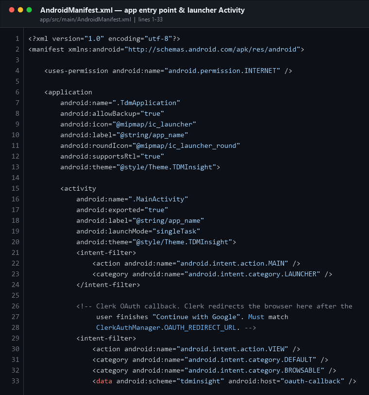

**What it does, line by line:**

| Line | Meaning |
|---|---|
| 4 | `INTERNET` is the **only** permission the app requests. It needs it to reach Supabase and Clerk. No camera, no storage, no location. |
| 6–13 | The `<application>` tag. `android:name=".TdmApplication"` tells Android to use **your custom Application class** instead of the default one. |
| 15–20 | Declares `MainActivity`. `exported="true"` is required because it is the launcher. `launchMode="singleTask"` means the OAuth browser returns to the **same** instance instead of opening a second copy. |
| 21–24 | **This is what makes the app appear in the launcher.** `action.MAIN` + `category.LAUNCHER` = "this is the icon the user taps". |
| 29–33 | A **second** intent filter: a deep link. When Clerk finishes Google sign-in in the browser it redirects to `tdminsight://oauth-callback`, and Android routes that URL back into `MainActivity`. |

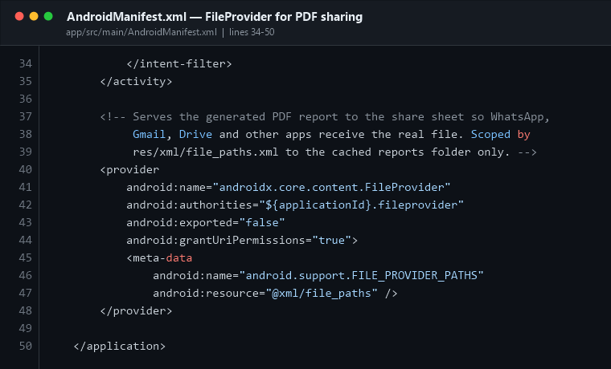

The `<provider>` block registers a **FileProvider**. When the user shares a PDF
report, Android is not allowed to hand another app a raw file path — it must hand
over a `content://` URI. `file_paths.xml` (shown in Part 11) limits what can be
shared to exactly one cache folder.

💬 **If the teacher asks "what is the entry point of your app?"**
> "`AndroidManifest.xml` declares `MainActivity` with the MAIN/LAUNCHER intent filter,
> so when the user taps the icon Android creates `MainActivity` and calls its
> `onCreate()`. Before that, `TdmApplication.onCreate()` runs, because it is registered
> as the application class."

## 3.2 app/build.gradle.kts — SDK versions and secret keys

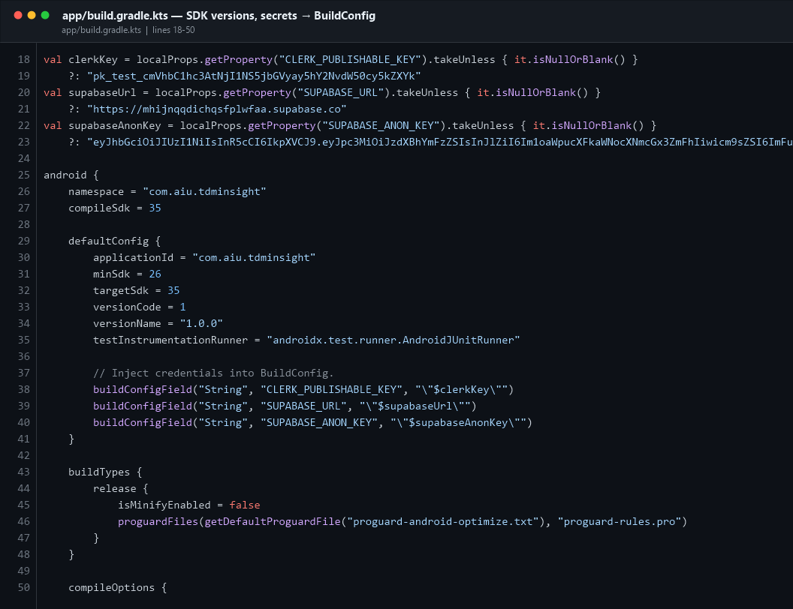

**Key facts to memorise:**

| Setting | Value | Meaning |
|---|---|---|
| `namespace` / `applicationId` | `com.aiu.tdminsight` | The unique ID of the app on the Play Store and on the device |
| `compileSdk` / `targetSdk` | 35 | Built and tested against Android 15 |
| `minSdk` | 26 | Runs on Android 8.0 Oreo and newer |
| `versionCode` / `versionName` | 1 / "1.0.0" | Release numbering |
| `buildConfigField` | 3 fields | Injects the Clerk and Supabase keys into a generated `BuildConfig` class so they are readable from Kotlin |

Lines 22–27 read the keys from `local.properties` (which is git-ignored), and fall
back to a hard-coded default if the file is missing.

> ⚠️ **Honest note you should be ready to defend:** those fallback keys are real and
> currently committed in the file. They are *publishable/anon* keys — they are designed
> to be visible in a client app — but the safe practice is to keep only a placeholder
> in the fallback and require `local.properties`. If the teacher raises it, say:
> "Yes — the anon key is public by design, but row-level security in `update_v4.sql`
> is what actually protects the data, and the fallback should ideally be blank."

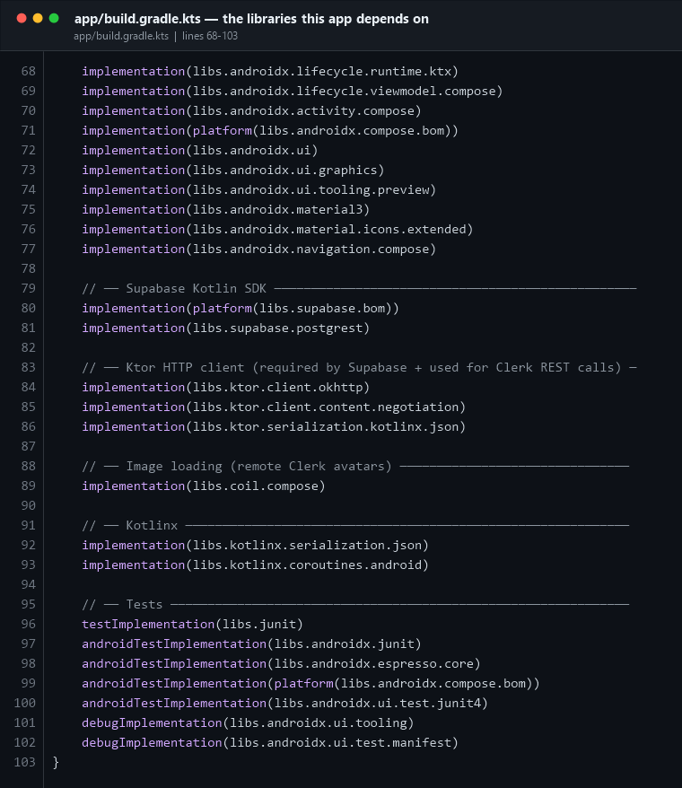

**Every library and why it is here:**

| Dependency | Why |
|---|---|
| `androidx.activity:activity-compose` | Lets `ComponentActivity` host Compose via `setContent { }` |
| `compose-bom` | A "bill of materials" that pins all Compose libraries to one compatible set |
| `androidx.compose.material3` | Material Design 3 components: `Scaffold`, `Button`, `Surface`, `TopAppBar` |
| `material-icons-extended` | The icon set (`Icons.Filled.Home`, `Icons.Outlined.Science`, …) |
| `androidx.navigation:navigation-compose` | The `NavHost` / `NavController` used in `NavGraph.kt` |
| `lifecycle-viewmodel-compose` | The `viewModel()` function that gives a Composable its ViewModel |
| `supabase-postgrest` | Talks to the PostgreSQL REST API |
| `ktor-client-okhttp` | The HTTP engine; used by Supabase **and** directly by `ClerkAuthManager` |
| `kotlinx-serialization-json` | Converts Kotlin data classes ↔ JSON |
| `kotlinx-coroutines-android` | `suspend` functions, `viewModelScope`, background threads |
| `coil-compose` | Loads the user's Google profile picture from a URL |
| `junit` | Unit tests |

💬 **"Which libraries did you use?"**
> "Jetpack Compose with Material 3 for the UI, Navigation-Compose for screen routing,
> Lifecycle-ViewModel for state, the Supabase Kotlin SDK on top of Ktor for the
> database, kotlinx-serialization for JSON, Coroutines for async work, Coil for
> images, and JUnit for tests. Versions are centralised in `gradle/libs.versions.toml`."

---

# PART 4 · The Application class and the MAIN ACTIVITY

## 4.1 TdmApplication — created before anything else

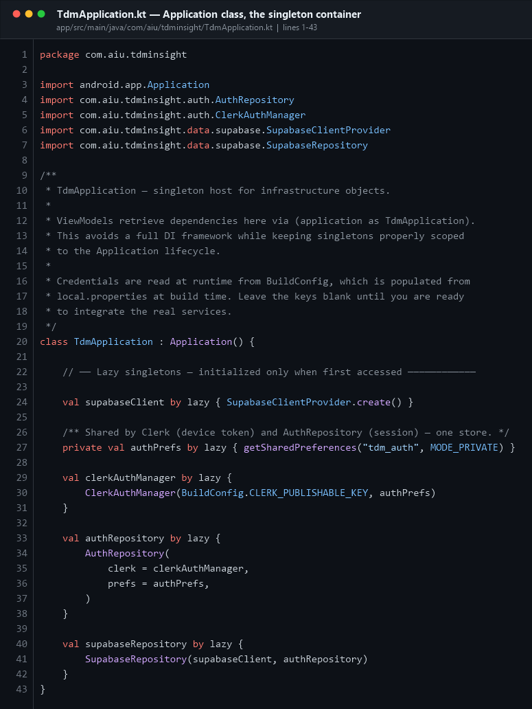

This class exists **once** for the whole process. It creates the shared objects
(`SupabaseClient`, `ClerkAuthManager`, `AuthRepository`, `SupabaseRepository`) as
`by lazy` singletons — meaning each one is built the first time it is used, and never
built twice.

This is **manual dependency injection**. A bigger app would use Hilt or Koin; here the
ViewModels simply do `(application as TdmApplication).supabaseRepository`.

💬 **"Why is there an Application class?"**
> "So the Supabase client and the Clerk auth manager exist once for the whole app
> lifetime instead of being recreated on every screen. It is lightweight dependency
> injection without adding a DI framework."

## 4.2 ★ MainActivity — THE MAIN ACTIVITY

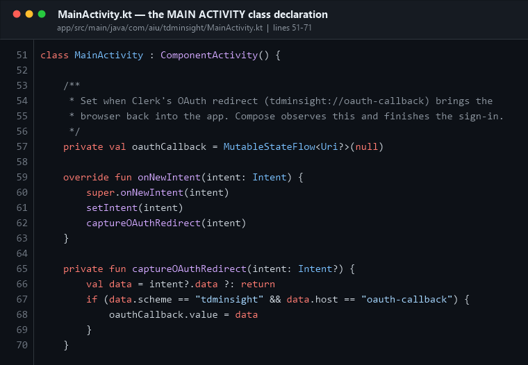

**`MainActivity` is the one and only Activity in this app.** This is a
*single-Activity architecture*: every "screen" you see is a Composable function, not a
separate Activity or Fragment.

It extends **`ComponentActivity`** (not `AppCompatActivity`) because Compose does not
need the AppCompat theme machinery.

Lines 59–70 handle the OAuth deep link: when the browser returns to
`tdminsight://oauth-callback`, Android calls `onNewIntent()`, and the URL is pushed
into a `MutableStateFlow` that Compose is watching.

## 4.3 onCreate() and setContent — where the UI begins

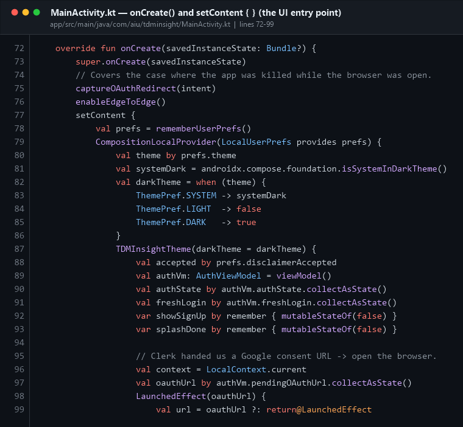

**This is the most important function in the whole app.** Read it step by step:

| Line | What happens |
|---|---|
| 72 | `onCreate()` — the Android lifecycle callback that runs when the Activity is created. |
| 73 | `super.onCreate()` — always call the parent first. |
| 76 | `enableEdgeToEdge()` — lets the app draw behind the status and navigation bars. |
| 77 | **`setContent { }`** — this replaces `setContentView(R.layout.…)` from the old XML world. Everything inside this block is the app's UI. |
| 78–79 | Loads saved preferences and publishes them through a `CompositionLocalProvider` so *any* screen can read the theme. |
| 82–86 | Decides dark vs light: follow the system, or force one. |
| 87 | `TDMInsightTheme { }` wraps everything in the Material 3 theme. |
| 89 | `viewModel()` creates (or reuses) the `AuthViewModel` scoped to this Activity. |
| 90–93 | `collectAsState()` converts the ViewModel's `StateFlow`s into Compose state — when the flow emits, the UI recomposes automatically. |

## 4.4 The top-level screen gate

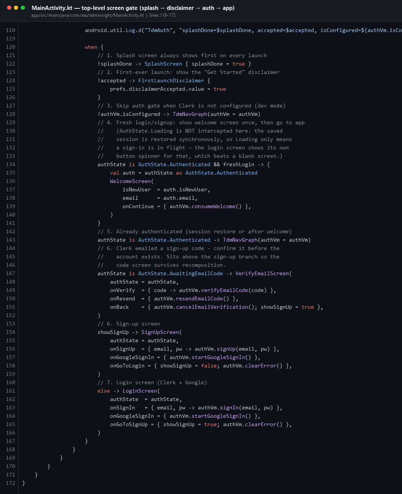

This `when { }` block decides **which of six "pre-app" screens** the user sees before
the real navigation graph starts. It is evaluated top-to-bottom and the first true
branch wins:

1. `!splashDone` → **SplashScreen** (always, 1.8 seconds)
2. `!accepted` → **FirstLaunchDisclaimer** ("I understand — get started")
3. `!authVm.isConfigured` → straight into the app (developer mode with no Clerk key)
4. Authenticated **and** just logged in → **WelcomeScreen** (shown once)
5. Authenticated → **`TdmNavGraph(authVm)`** ← the real app starts here
6. Awaiting email code → **VerifyEmailScreen**
7. `showSignUp` → **SignUpScreen**
8. otherwise → **LoginScreen**

💬 **"What is your MainActivity and what does it do?"**
> "`MainActivity` is the only Activity. In `onCreate()` it calls `setContent`, which
> hosts the whole Compose UI. Inside, it applies the theme, observes the
> `AuthViewModel`, and uses a `when` block to choose between splash, disclaimer,
> login, sign-up, email verification, welcome, or the main navigation graph. It also
> catches the Clerk OAuth deep-link redirect."

---

# PART 5 · Navigation — how screens are connected

## 5.1 Routes — every screen address

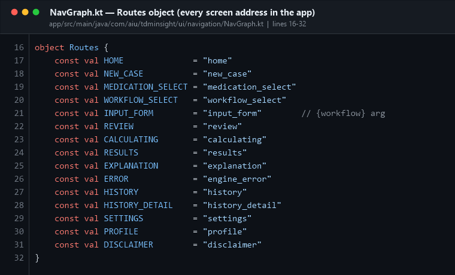

`Routes` is a plain Kotlin `object` holding 15 `const val` strings. Using constants
instead of typing `"home"` everywhere means a typo becomes a **compile error** rather
than a crash at runtime.

## 5.2 NavHost — the route → screen table

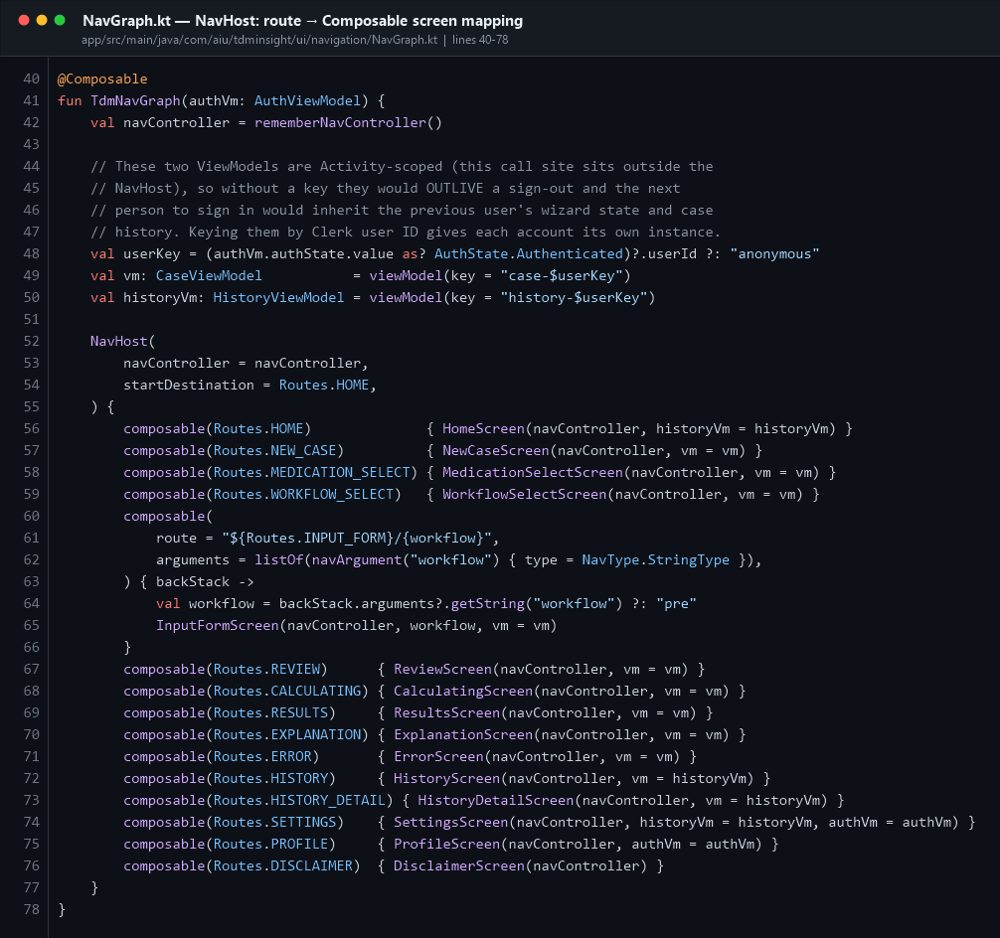

| Concept | Where | Explanation |
|---|---|---|
| `rememberNavController()` | line 42 | Creates the controller that owns the back stack |
| `viewModel(key = "case-$userKey")` | 49–50 | The ViewModels are keyed by Clerk user ID, so when one user signs out the next user does **not** inherit their wizard state or history |
| `NavHost(startDestination = Routes.HOME)` | 52–55 | Home is the first screen after login |
| `composable(Routes.X) { Screen(...) }` | 56–76 | One line per screen — this is the routing table |
| `composable("input_form/{workflow}")` | 60–66 | The **only** route with an argument. The workflow name (`pre`, `post`, `pre_post`) travels in the URL and is read back with `backStack.arguments?.getString("workflow")` |

Navigation is triggered from a screen with `nav.navigate(Routes.RESULTS)` and the back
button is `nav.popBackStack()`.

💬 **"How do you move between screens?"**
> "Navigation-Compose. `NavGraph.kt` declares a `NavHost` that maps a route string to
> a Composable. Screens call `nav.navigate(Routes.X)` to go forward and
> `nav.popBackStack()` to go back. One route, the input form, carries the chosen
> workflow as a path argument."

---

# PART 6 · The data models

## 6.1 Input models — what the user types

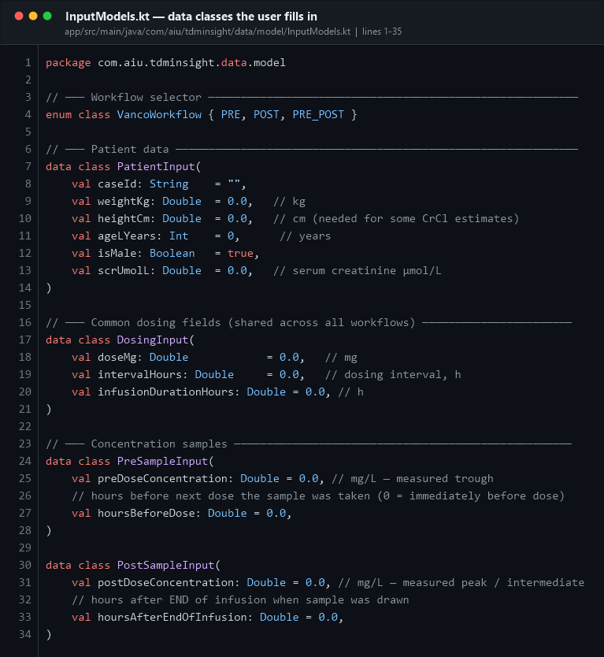

Five small `data class`es and one `enum`:

- `VancoWorkflow` — `PRE`, `POST`, `PRE_POST`
- `PatientInput` — caseId, weight, height, age, sex, serum creatinine
- `DosingInput` — dose (mg), interval τ (h), infusion duration (h)
- `PreSampleInput` — trough concentration + time
- `PostSampleInput` — peak concentration + time
- Three wrapper classes (`PreWorkflowInput`, …) that bundle exactly what each engine
  function needs

Kotlin `data class` gives you `equals()`, `hashCode()`, `toString()` and — crucially
for this app — **`copy()`**, which is how the UI updates one field without mutating
state (see Part 9.2).

## 6.2 Result models — what the engine produces

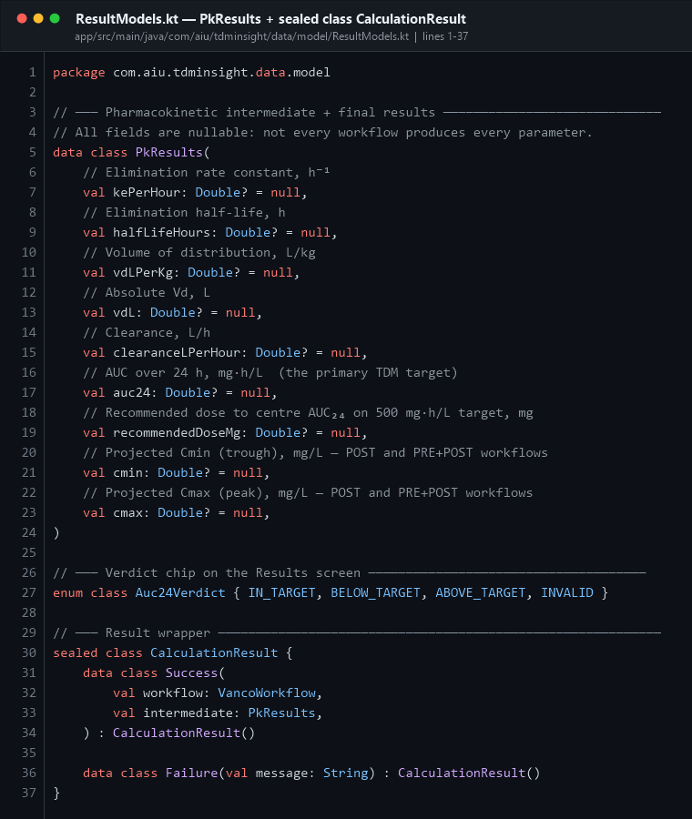

- `PkResults` — every derived number, **all nullable**, because not every workflow
  produces every parameter (e.g. the PRE workflow cannot give a Cmax).
- `Auc24Verdict` — `IN_TARGET` / `BELOW_TARGET` / `ABOVE_TARGET` / `INVALID`
- `CalculationResult` — a **sealed class** with exactly two subtypes: `Success` and
  `Failure`.

A sealed class is a closed set of types. Because the compiler knows there are only
two, a `when` over it is exhaustive and you can never forget to handle the error case.

## 6.3 HistoryEntry — one saved case

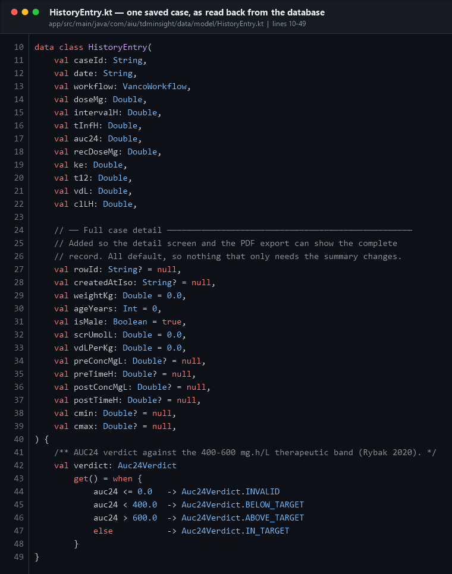

This is the domain model for a row read back from the database. Note the
**computed property** `verdict` at lines 41–48: it is not stored anywhere — it is
recalculated from `auc24` every time it is read, comparing against the 400–600 band.

---

# PART 7 · Validation — stopping bad data before the maths

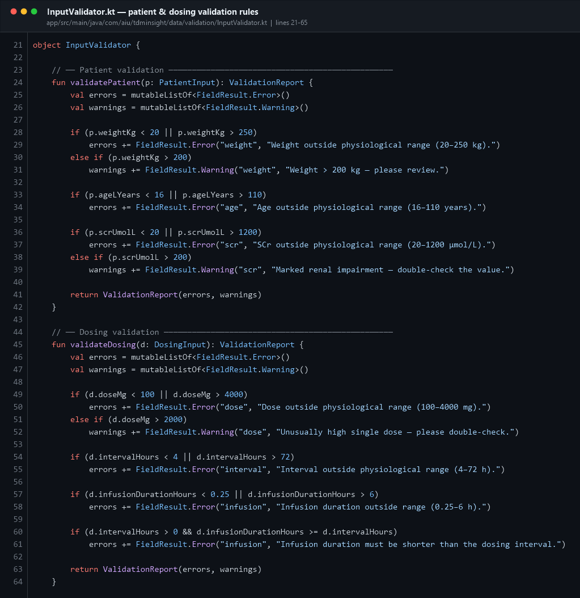

`InputValidator` is a Kotlin `object` (a singleton) with **no Android imports**, so it
can be unit-tested on a plain JVM.

It distinguishes two severities:

- **`FieldResult.Error`** — blocking. The "Review inputs" button stays disabled.
- **`FieldResult.Warning`** — advisory. Amber banner, but you can continue.

| Field | Hard range (error) | Soft limit (warning) |
|---|---|---|
| Weight | 20–250 kg | > 200 kg |
| Age | 16–110 years | — |
| Serum creatinine | 20–1200 µmol/L | > 200 µmol/L |
| Dose | 100–4000 mg | > 2000 mg |
| Interval τ | 4–72 h | — |
| Infusion duration | 0.25–6 h, and must be **< τ** | — |
| Trough concentration | 0.1–80 mg/L | > 25 mg/L |
| Peak concentration | 0.1–120 mg/L | > 60 mg/L |

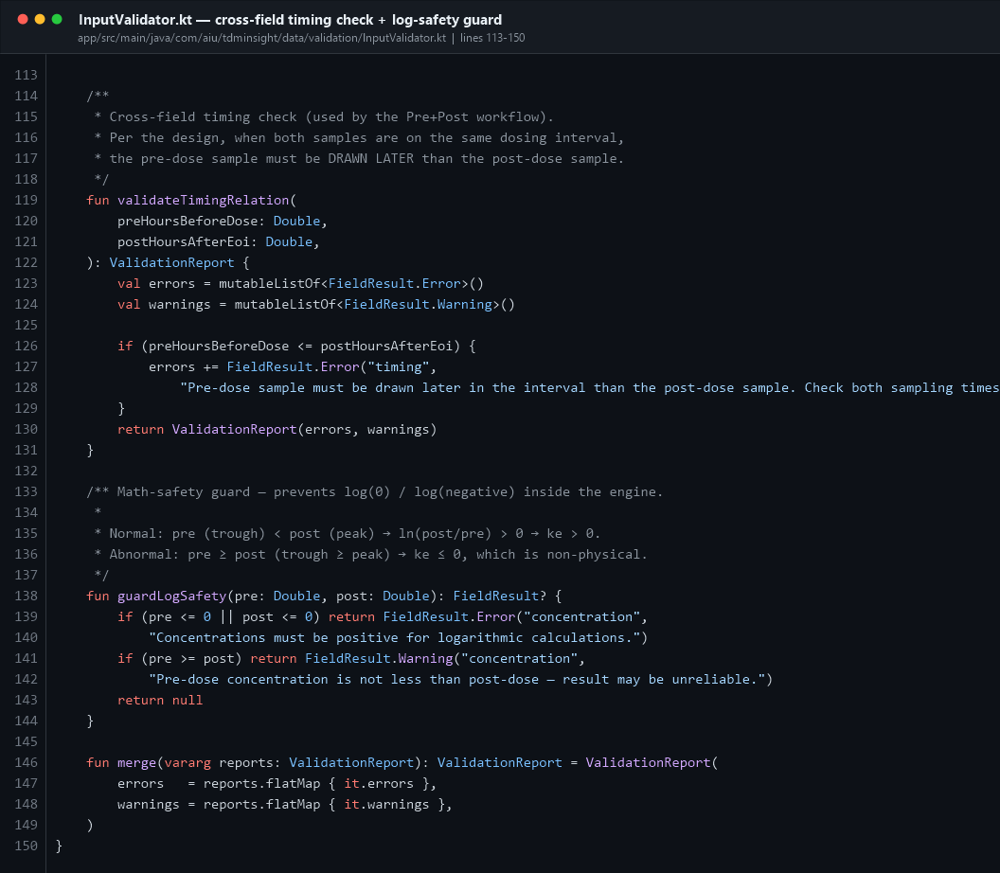

Two special checks:

- **`validateTimingRelation`** — in the PRE+POST workflow the trough must be drawn
  *later* in the interval than the peak, otherwise the regression slope is backwards.
- **`guardLogSafety`** — the Sawchuk–Zaske formula takes `ln(Cpeak / Ctrough)`. If
  either value is ≤ 0 you get `NaN` or `-Infinity`. This guard catches it **before**
  the engine runs.

`merge(vararg reports)` combines several reports into one so the UI can show all
errors at once.

💬 **"How do you handle invalid input?"**
> "`InputValidator` runs on every keystroke via a `LaunchedEffect`. It returns a
> `ValidationReport` with blocking errors and non-blocking warnings. Blocking errors
> disable the Continue button and show a red banner. The engine also re-validates
> defensively, and there is a maths-safety guard so we never take the log of zero."

---

# PART 8 · ★ THE LOGIC SECTION — VancoEngine

> **This is the answer to "where is your logic written?"**
> `app/src/main/java/com/aiu/tdminsight/domain/engine/VancoEngine.kt`

`VancoEngine` is a Kotlin `object` — a singleton with no state. It imports only
`kotlin.math` and your own models. **Zero Android imports.** That is deliberate: it
means the maths can be unit-tested without an emulator, and it can never crash because
of a UI problem.

## 8.1 Constants and shared formulas

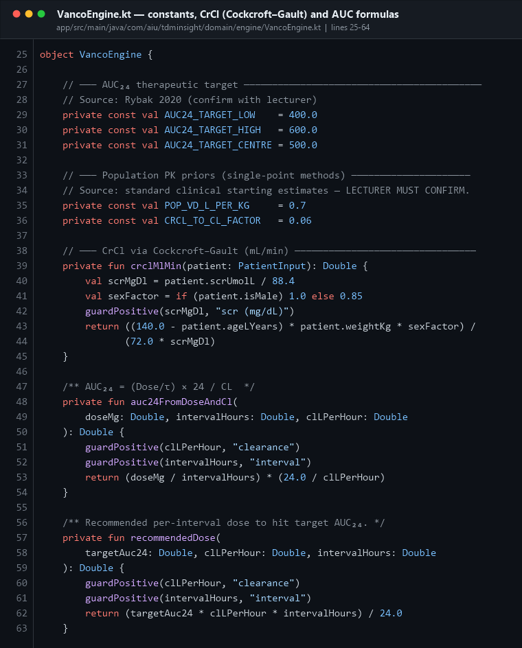

| Constant | Value | Source |
|---|---|---|
| `AUC24_TARGET_LOW / HIGH` | 400 / 600 mg·h/L | Rybak 2020 |
| `AUC24_TARGET_CENTRE` | 500 mg·h/L | the dose recommendation aims here |
| `POP_VD_L_PER_KG` | 0.7 L/kg | population prior for volume of distribution |
| `CRCL_TO_CL_FACTOR` | 0.06 | converts CrCl (mL/min) to vancomycin CL (L/h) |

Three private helper functions:

```
CrCl (Cockcroft–Gault)  =  (140 − age) × weight × sexFactor / (72 × SCr_mg/dL)
                           sexFactor = 1.0 male, 0.85 female
                           SCr_mg/dL = SCr_µmol/L ÷ 88.4

AUC₂₄                   =  (Dose / τ) × 24 / CL

Recommended dose        =  AUC_target × CL × τ / 24
```

## 8.2 The PRE workflow

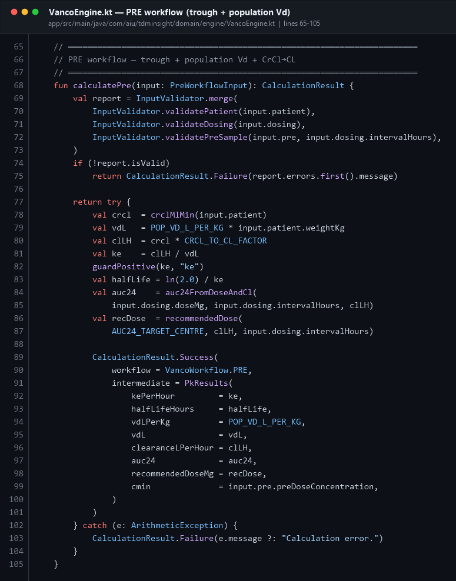

Used when only a **trough** is available.

1. Estimate creatinine clearance with Cockcroft–Gault.
2. Estimate Vd from the population prior: `Vd = 0.7 × weight`.
3. Estimate clearance: `CL = CrCl × 0.06`.
4. Derive `ke = CL / Vd`, then `t½ = ln(2) / ke`.
5. Compute AUC₂₄ and the recommended dose.

## 8.3 The POST workflow — Newton–Raphson

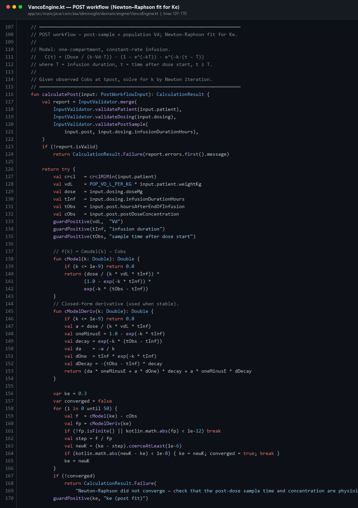

Used when only a **peak** is available. There is no closed-form solution for `ke`
here, so the engine solves it **numerically**.

The one-compartment constant-rate infusion model is:

```
C(t) = (Dose / (ke · Vd · T)) × (1 − e^(−ke·T)) × e^(−ke·(t − T))
```

We know `C(t)` (the measured concentration) and want `ke`. The code:

- defines `cModel(k)` — the predicted concentration for a candidate `k` (line 138)
- defines `cModelDeriv(k)` — the analytic derivative (line 145)
- iterates up to **50 times** from a starting guess of `ke₀ = 0.3 h⁻¹` (line 156–166)
- each step: `k_new = k − f(k)/f'(k)`, clamped to stay positive
- stops when the change is smaller than `1e-8` and sets `converged = true`
- **if it never converges, it returns `CalculationResult.Failure` with a readable
  message** instead of returning nonsense (lines 167–169)

💬 **"What is Newton–Raphson doing here?"**
> "The peak-only workflow has one equation with one unknown, `ke`, but you cannot
> rearrange it algebraically. Newton–Raphson starts at 0.3 h⁻¹ and repeatedly steps
> `k − f(k)/f′(k)` until the answer stops moving. If 50 iterations are not enough it
> reports a failure rather than guessing."

## 8.4 The PRE+POST workflow — Sawchuk–Zaske

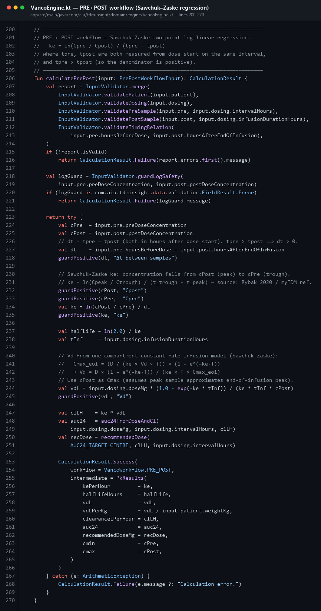

The most accurate method, because both parameters come from the patient's own blood:

```
ke  = ln(C_peak / C_trough) / (t_trough − t_peak)
t½  = ln(2) / ke
Vd  = Dose × (1 − e^(−ke·T)) / (ke × T × C_peak)
CL  = ke × Vd
```

Note the defensive ordering at lines 207–235: **validate → log-safety guard →
guard each derived value is positive → only then compute**. `guardPositive()`
(line 272) throws an `ArithmeticException` that the surrounding `try/catch` converts
into a clean `CalculationResult.Failure`.

💬 **"How do you prevent divide-by-zero and log-of-zero errors?"**
> "Three layers. `InputValidator` blocks physiologically impossible values.
> `guardLogSafety` checks the concentrations before any logarithm. And inside the
> engine every derived quantity — Δt, ke, Vd, CL — passes through `guardPositive()`,
> which throws an `ArithmeticException` that is caught and returned as a `Failure`.
> The app shows an error screen; it never crashes."

---

# PART 9 · ViewModels — state and event handling

## 9.1 CaseUiState and the update functions

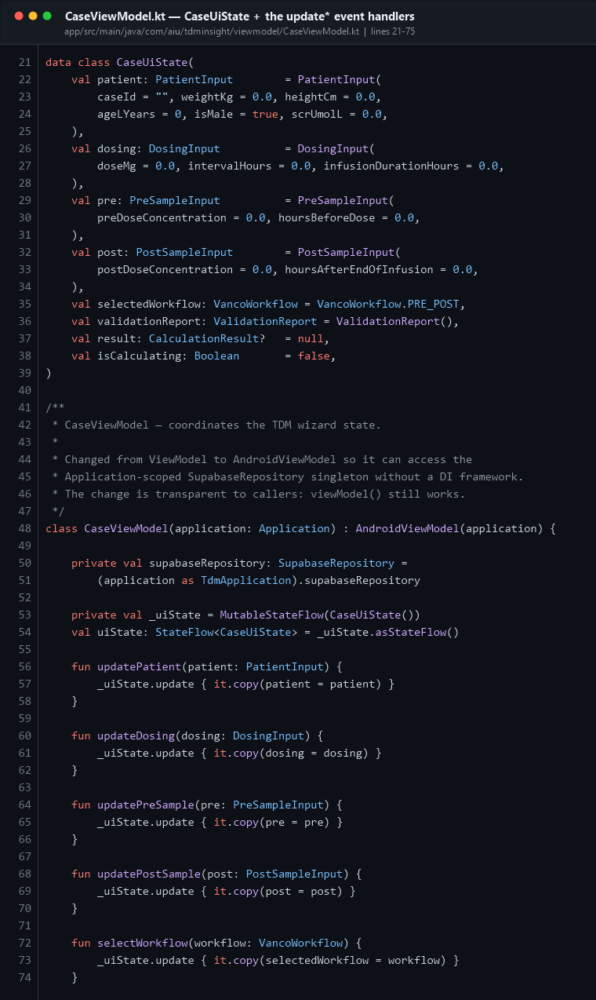

`CaseUiState` is **one immutable object holding the entire wizard state**: patient,
dosing, both samples, the chosen workflow, the validation report, the result, and an
`isCalculating` flag.

`CaseViewModel` extends `AndroidViewModel` (not plain `ViewModel`) so it can reach
`TdmApplication` and get the `SupabaseRepository`.

The state pattern:

```kotlin
private val _uiState = MutableStateFlow(CaseUiState())   // private, writable
val uiState: StateFlow<CaseUiState> = _uiState.asStateFlow()  // public, read-only
```

This is **encapsulation**: the UI can read the state but only the ViewModel can change
it. Each `updateX()` function does `_uiState.update { it.copy(field = newValue) }` —
never mutating the old object, always producing a new one. Compose compares the old
and new state and redraws only what changed.

## 9.2 ★ validate() and runCalculation() — the event handlers

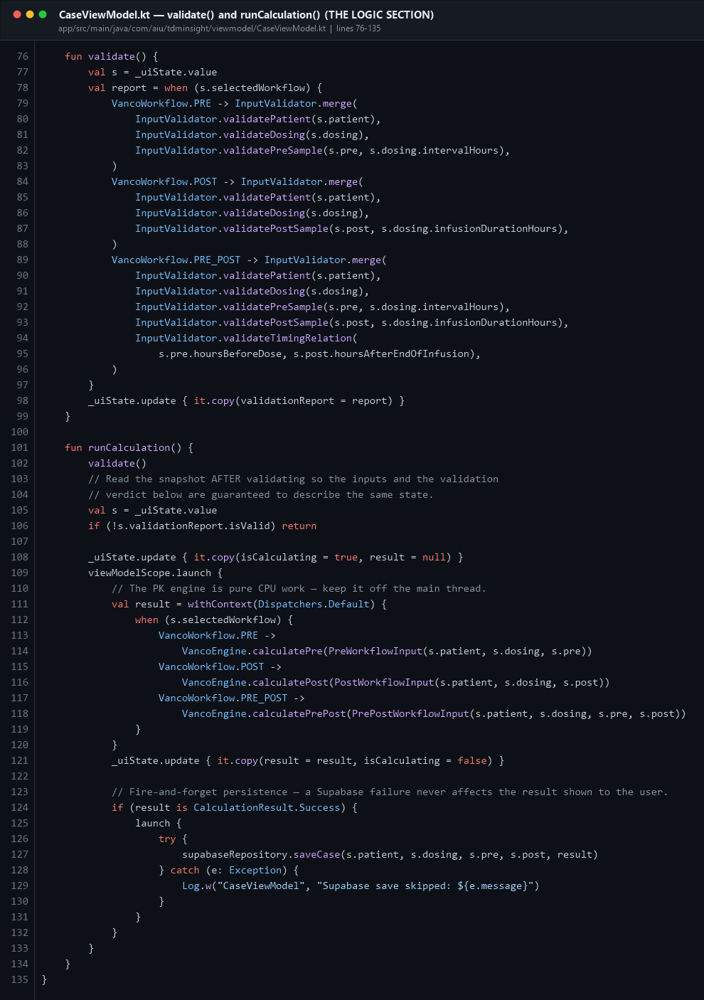

**`validate()`** (line 76) picks the right set of validators for the chosen workflow
and stores the merged report in state.

**`runCalculation()`** (line 101) is the function that the "Run calculation" button
fires. Trace it:

| Line | What happens |
|---|---|
| 102 | validate first |
| 105–106 | take a snapshot of state **after** validating, and bail out if invalid |
| 108 | flip `isCalculating = true` so the UI can show the spinner |
| 109 | `viewModelScope.launch { }` — a coroutine tied to the ViewModel's lifetime; if the user leaves, it is cancelled automatically |
| 111 | `withContext(Dispatchers.Default)` — the maths runs on a **background thread**, keeping the UI at 60 fps |
| 112–119 | `when` on the workflow → call the matching `VancoEngine` function |
| 121 | publish the result and clear the spinner |
| 124–131 | **fire-and-forget save**: a nested `launch` writes to Supabase in a `try/catch`, so a network failure is logged but never affects the result the user already sees |

💬 **"Where does the calculation happen and on which thread?"**
> "The button calls `CaseViewModel.runCalculation()`. It validates, then launches a
> coroutine in `viewModelScope` and runs `VancoEngine` inside
> `withContext(Dispatchers.Default)` so the main thread is never blocked. The result
> is pushed back into the `StateFlow`, and Compose recomposes the Results screen."

## 9.3 AuthViewModel

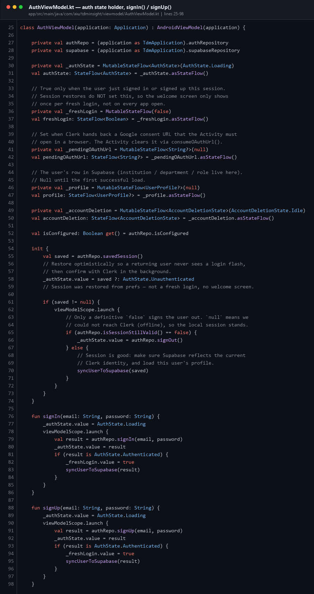

Single source of truth for *who is signed in*. Notes:

- It is created **once per Activity** in `MainActivity`, then passed down. The comment
  at lines 16–24 explains why: calling `viewModel()` inside a `NavHost` would silently
  create a *second* instance, and signing out of one would not update the other.
- `init { }` (line 54) restores the saved session **optimistically** so a returning
  user never sees a login flash, then confirms with Clerk in the background. Only a
  definitive `false` signs them out — `null` means "offline", and the local session
  stands.
- `_freshLogin` makes the Welcome screen appear only after an actual sign-in, not on
  every app restart.

## 9.4 HistoryViewModel

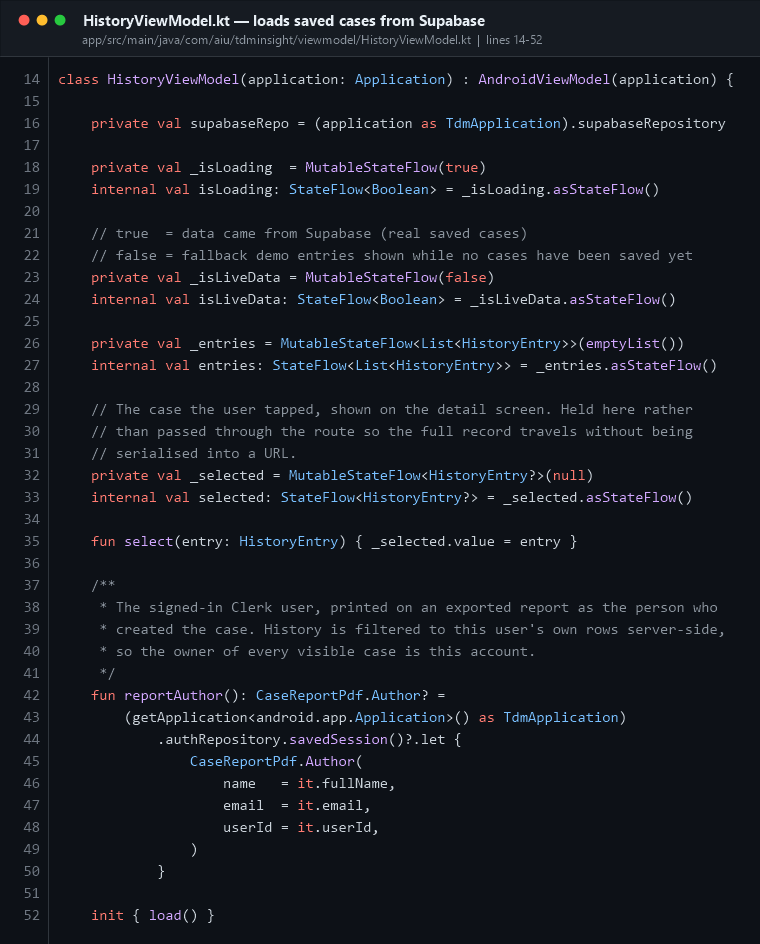

Holds the list of saved cases, a loading flag, and the currently selected entry. The
selected entry is held **here** rather than passed through the navigation route,
because a full case record would be ugly and lossy to serialise into a URL string.

---

# PART 10 · ★ THE DATABASE SECTION

> **This is the answer to "which section is the database?"**
> Two places: the **SQL** that defines the tables lives in `Kotlin_app/supabase/*.sql`,
> and the **Kotlin code** that reads and writes them lives in
> `data/supabase/` (three files).

## 10.1 The SQL schema — table 1: `cases`

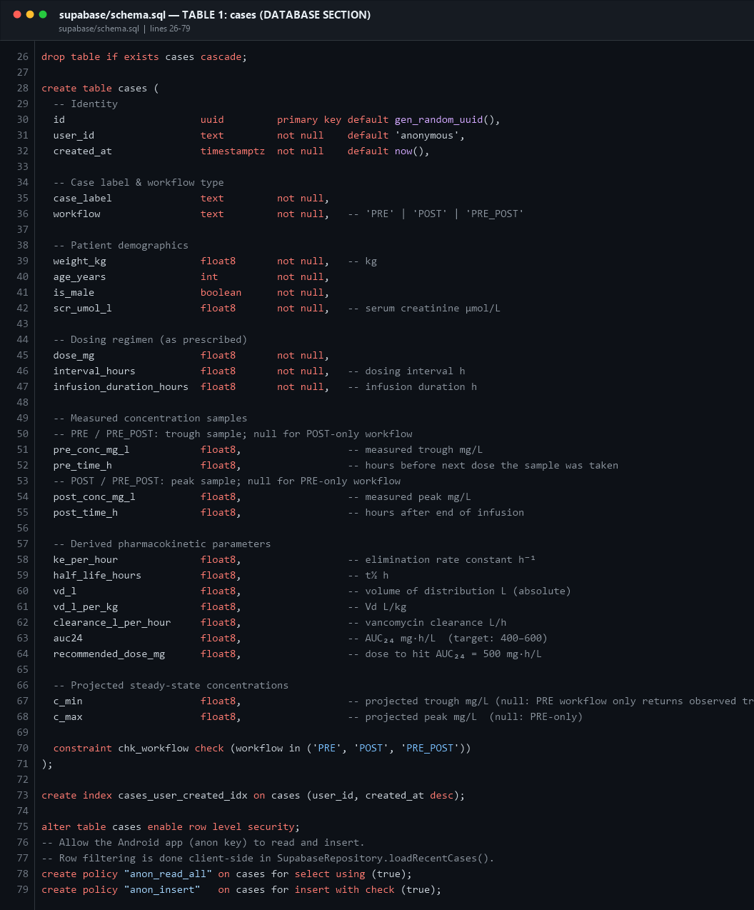

One row per completed calculation. Column groups:

| Group | Columns |
|---|---|
| Identity | `id` (uuid primary key, auto-generated), `user_id` (Clerk ID), `created_at` |
| Case | `case_label`, `workflow` (constrained to PRE/POST/PRE_POST) |
| Patient | `weight_kg`, `age_years`, `is_male`, `scr_umol_l` |
| Dosing | `dose_mg`, `interval_hours`, `infusion_duration_hours` |
| Samples | `pre_conc_mg_l`, `pre_time_h`, `post_conc_mg_l`, `post_time_h` (nullable) |
| PK results | `ke_per_hour`, `half_life_hours`, `vd_l`, `vd_l_per_kg`, `clearance_l_per_hour`, `auc24`, `recommended_dose_mg` |
| Projections | `c_min`, `c_max` |

Three things worth pointing out:

1. **`constraint chk_workflow check (workflow in ('PRE','POST','PRE_POST'))`** — the
   database itself refuses an invalid workflow value.
2. **`create index cases_user_created_idx on cases (user_id, created_at desc)`** — a
   composite index that makes "the 20 newest cases for this user" a fast lookup.
3. **`alter table cases enable row level security`** — RLS is turned on, then policies
   decide who may read what.

## 10.2 The SQL schema — table 2: `user_profiles`

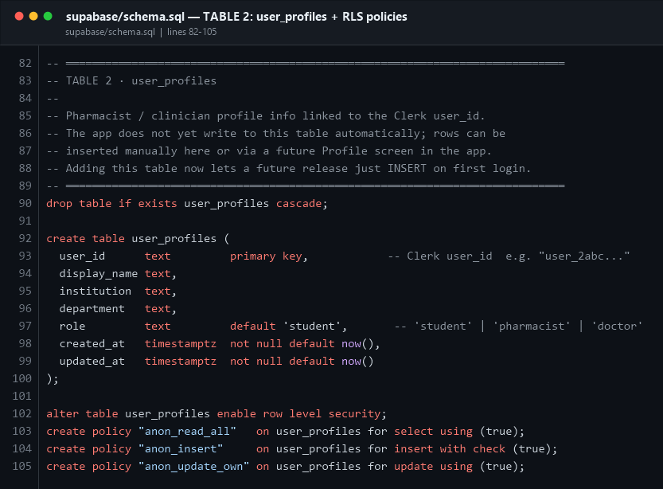

`user_id` (the Clerk user ID) is the **primary key**. That single design decision is
what guarantees "repeated logins never create duplicate users" — an upsert keyed on a
primary key can only ever produce one row.

Columns the app owns and Clerk must not overwrite: `institution`, `department`, `role`.

## 10.3 The migration files

| File | What it changes |
|---|---|
| `schema.sql` | Creates both tables, the index, open RLS policies, and 12 seed demo cases |
| `update_v2.sql` | Deletes the demo seed rows; prepares per-user RLS (Option A) with an open fallback (Option B) |
| `update_v3.sql` | Adds Clerk identity columns (`email`, `first_name`, `last_name`, `avatar_url`) + an `updated_at` trigger |
| `update_v4.sql` | Drops the `'anonymous'` default on `user_id` and documents the strict per-user RLS lock-down, commented out until the app sends Clerk JWTs to Supabase |

💬 **"Is the data secure?"**
> "Right now filtering is done with `eq("user_id", userId)` on every query, plus RLS is
> enabled on both tables. `update_v4.sql` contains the strict per-user policies that
> read the Clerk `sub` claim from the JWT; they are deliberately commented out until
> the Clerk→Supabase JWT template is configured, because switching them on before that
> would make every user's history look empty."

## 10.4 The Supabase client

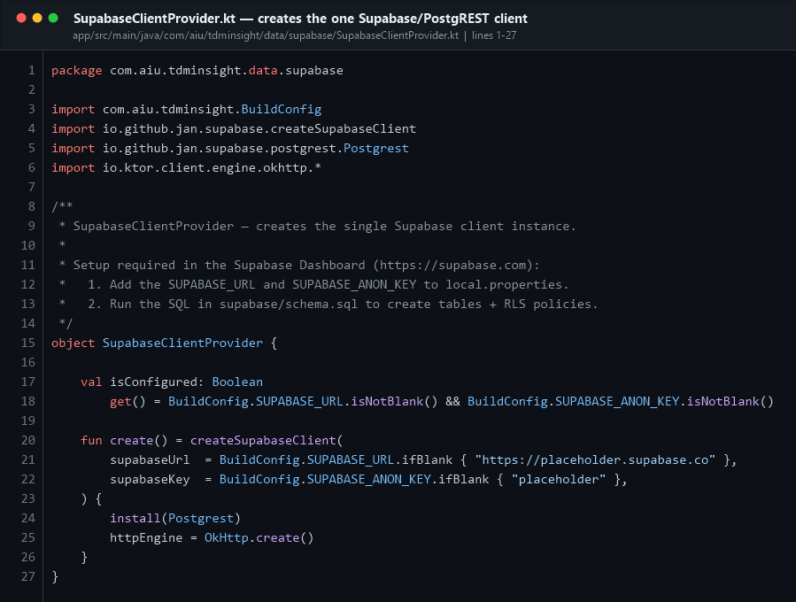

One object, one function: `create()` builds the `SupabaseClient` from the URL and anon
key in `BuildConfig`, installs the **Postgrest** plugin (the PostgreSQL REST layer)
and uses **OkHttp** as the transport.

## 10.5 DTOs — mapping Kotlin names to SQL columns

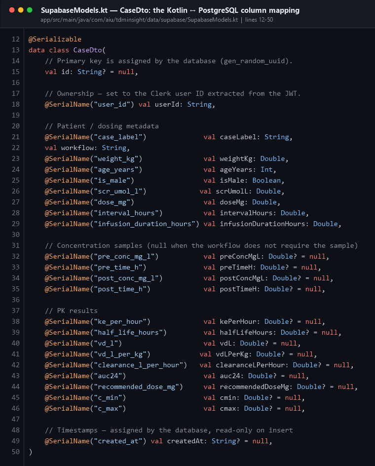

`CaseDto` is annotated `@Serializable`. Each field carries a
`@SerialName("snake_case")` annotation because **Kotlin uses camelCase and PostgreSQL
uses snake_case**. Without these the JSON keys would not match the column names.

Note `val id: String? = null` — the primary key is `null` on insert because the
database generates it with `gen_random_uuid()`.

Below the DTO, `toHistoryEntry()` is the **mapper** that converts a database row into
the domain model the UI understands. This keeps the UI independent of the database
schema.

## 10.6 saveCase() — INSERT

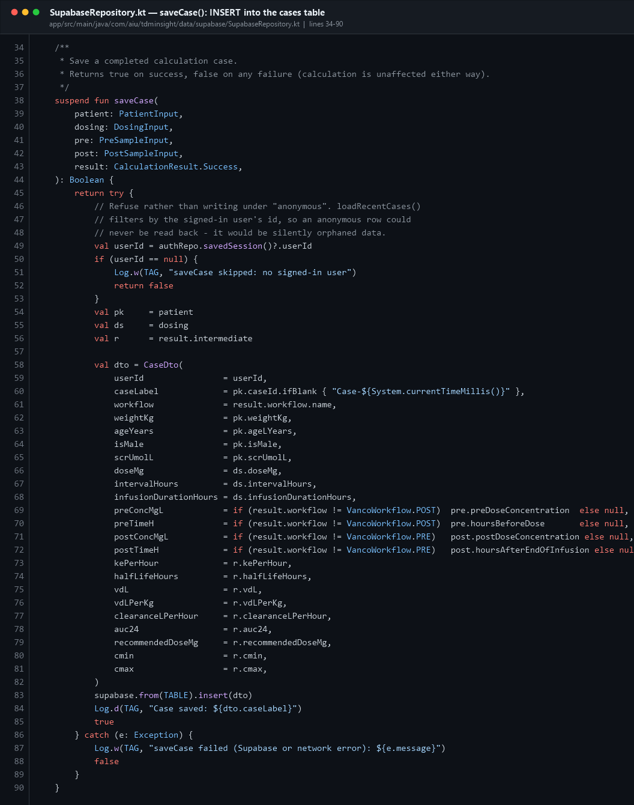

| Line | What happens |
|---|---|
| 49–53 | **Refuse to save without a signed-in user.** An "anonymous" row could never be read back, so it would be orphaned data. |
| 58–82 | Build the DTO. The conditional expressions on 69–72 send `null` for samples the chosen workflow did not use. |
| 60 | If the user left the Case ID blank, generate one from the timestamp. |
| 83 | `supabase.from("cases").insert(dto)` — the actual `INSERT`. |
| 86–89 | Catch **any** exception, log it, return `false`. The calculation the user is looking at is never affected. |

## 10.7 loadRecentCases() — SELECT

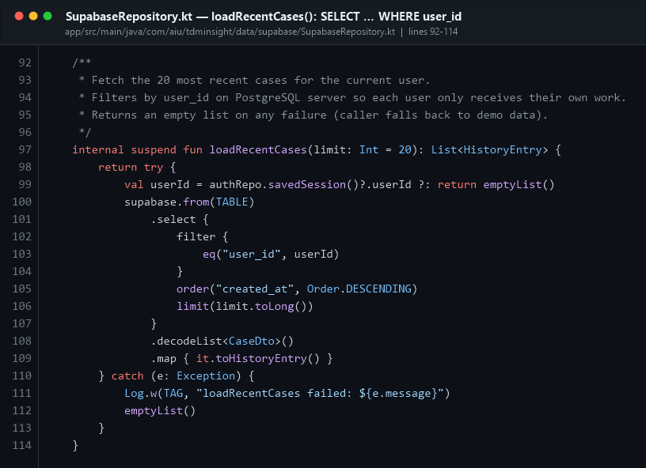

This is a `SELECT` expressed in Kotlin:

```kotlin
supabase.from("cases")
    .select {
        filter { eq("user_id", userId) }      //  WHERE user_id = ?
        order("created_at", Order.DESCENDING) //  ORDER BY created_at DESC
        limit(20)                             //  LIMIT 20
    }
    .decodeList<CaseDto>()                    //  JSON → List<CaseDto>
    .map { it.toHistoryEntry() }              //  DTO → domain model
```

## 10.8 syncUserProfile() — UPSERT (no duplicate users)

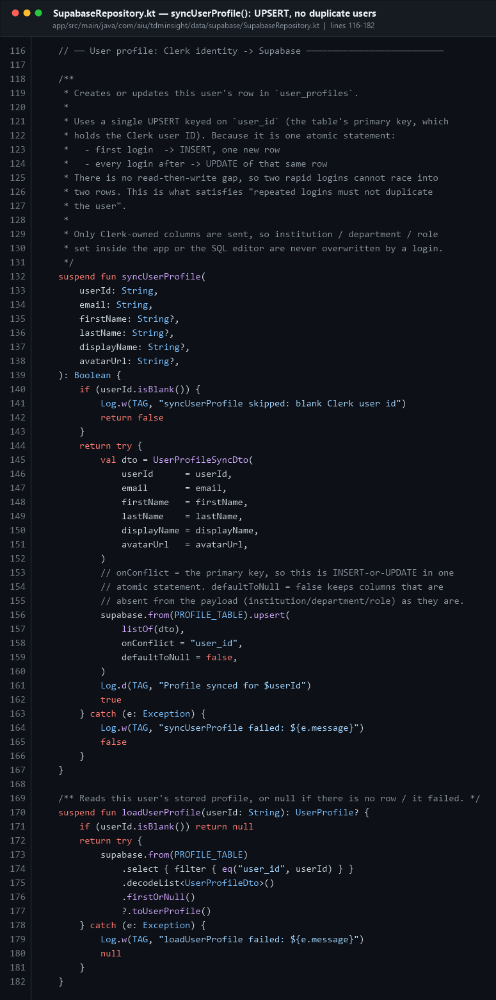

The comment at lines 118–131 is worth reading in full — it is the answer to a likely
exam question.

`upsert(listOf(dto), onConflict = "user_id", defaultToNull = false)` means:

- **first login** → `INSERT`, one new row
- **every login after** → `UPDATE` of that same row
- it is **one atomic statement**, so there is no read-then-write gap where two rapid
  logins could race into two rows
- `defaultToNull = false` means columns *absent* from the payload
  (`institution`, `department`, `role`) are left untouched — a login never wipes data
  the user or an administrator set

## 10.9 Deleting data

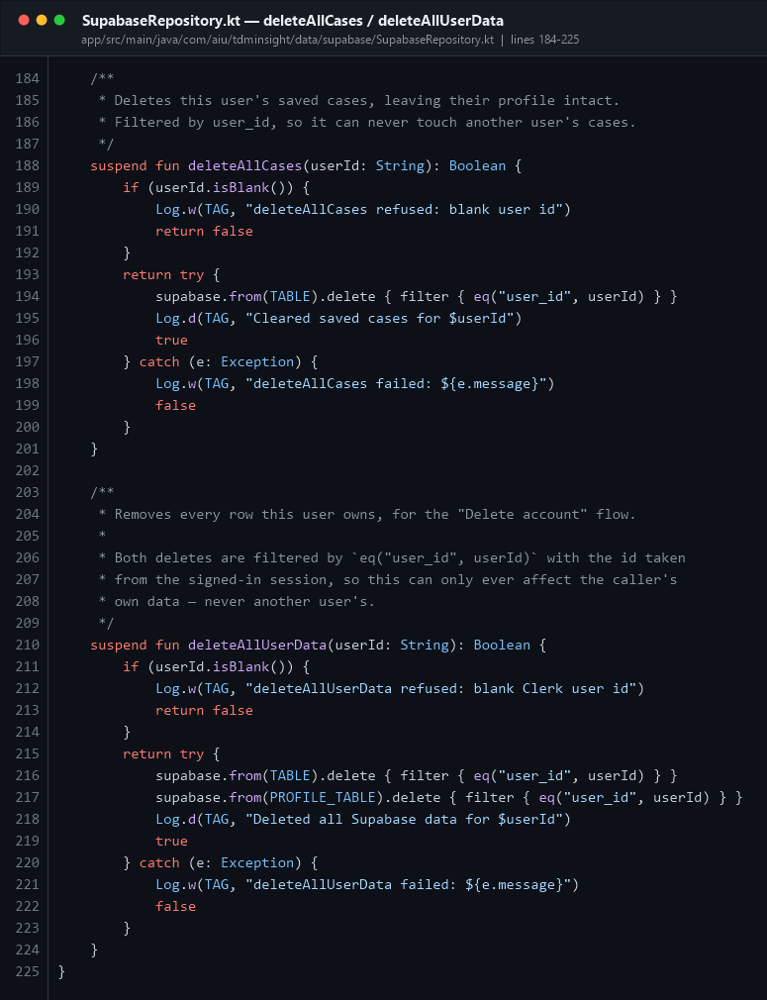

- `deleteAllCases(userId)` — "Clear saved cases" in Settings.
- `deleteAllUserData(userId)` — the "Delete account" flow: cases first, then profile.

Both refuse a blank user ID and both filter by `eq("user_id", userId)`, so they can
never touch another user's rows.

In `AuthViewModel.deleteAccount()` the **order matters**: Supabase rows are keyed by
the Clerk user ID, so they must be deleted *while that ID is still known*, before the
Clerk account itself is removed.

---

# PART 11 · Authentication (Clerk)

## 11.1 AuthState — a sealed class

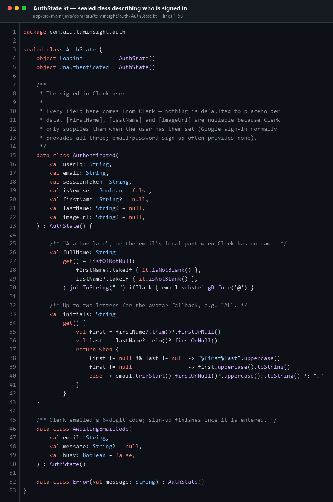

Five possible states: `Loading`, `Unauthenticated`, `Authenticated`,
`AwaitingEmailCode`, `Error`. Because it is **sealed**, the `when` in `MainActivity`
is exhaustive.

`Authenticated` has two computed properties: `fullName` (falls back to the email's
local part) and `initials` (for the avatar circle when there is no photo).

## 11.2 AuthRepository — staying logged in

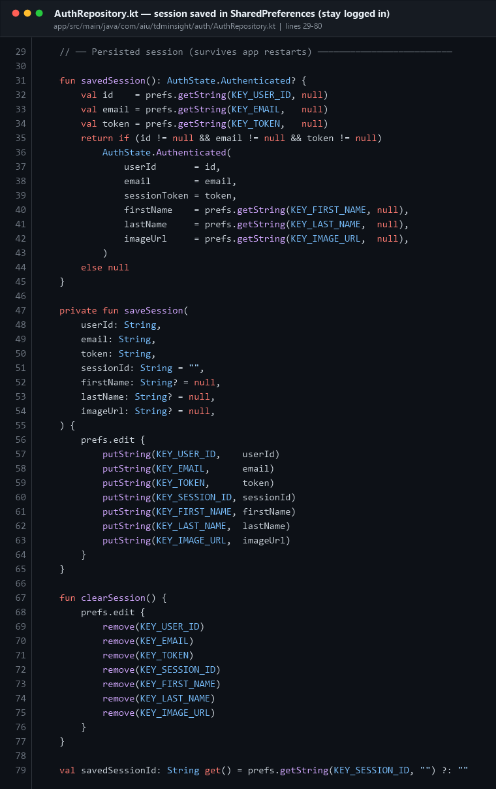

The session (user ID, email, token, name, avatar) is written to **private
SharedPreferences** under the name `tdm_auth`. That is why closing the app does not
log you out.

`savedSession()` reads it back; `clearSession()` wipes it on sign-out.

## 11.3 ClerkAuthManager — the raw HTTP layer

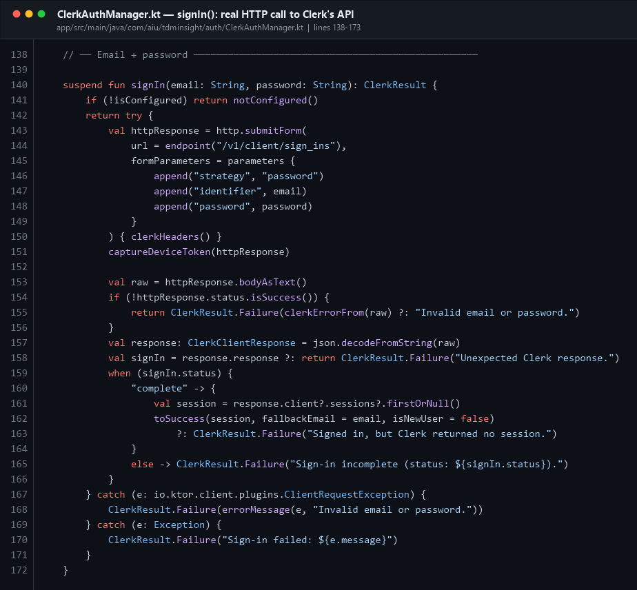

This class talks to Clerk's **Frontend API** directly with Ktor, rather than using
Clerk's Android SDK. `signIn()` posts `identifier` and `password` as a form to
`/v1/client/sign_ins?_is_native=1`.

The `_is_native=1` parameter matters: normally Clerk tracks the device with a cookie,
but there is no cookie jar here, so Clerk returns a **device token** in the
`Authorization` response header instead. That token is saved and replayed, which is
what lets the Google OAuth browser round-trip resolve back to the same Clerk client.

The full Google flow:

1. `startGoogleSignIn()` → Clerk returns a consent URL
2. `MainActivity` opens it with `Intent.ACTION_VIEW` (the system browser)
3. The user approves on Google's page
4. Clerk redirects to `tdminsight://oauth-callback?...`
5. The manifest's deep-link intent filter routes it back to `MainActivity.onNewIntent()`
6. `completeGoogleSignIn(url)` finishes the session

## 11.4 UserPrefs — theme and disclaimer

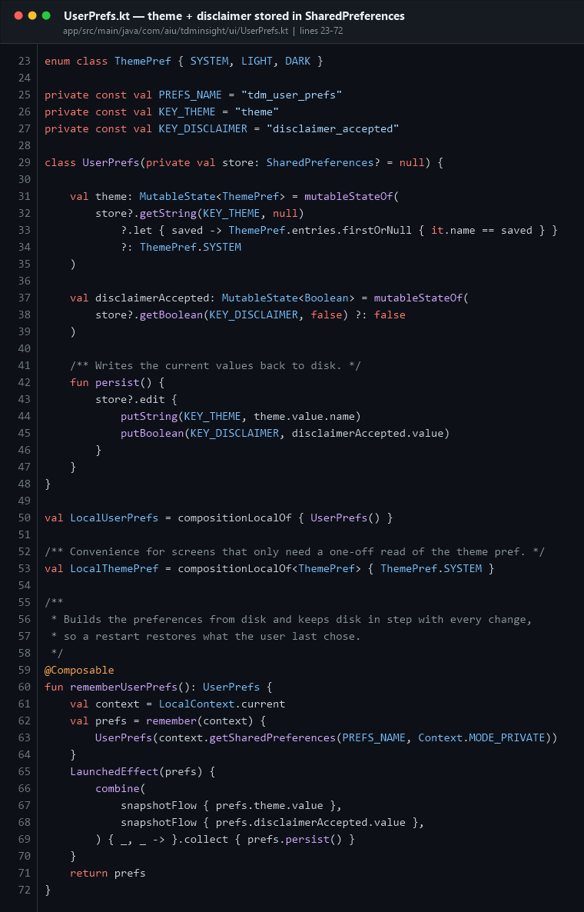

A second SharedPreferences store (`tdm_user_prefs`) holds the theme choice
(`SYSTEM` / `LIGHT` / `DARK`) and whether the first-launch disclaimer was accepted.
`rememberUserPrefs()` builds it and uses `snapshotFlow` + `combine` to write to disk
automatically whenever either value changes.

---

# PART 12 · ★ THE LAYOUT SECTION — how the UI is built

> **This is the answer to "where is your layout?"**
> There is no XML layout. The layout is Kotlin code in
> `app/src/main/java/com/aiu/tdminsight/ui/screens/` — 10 files holding 20 screens,
> plus the shared widgets in `ui/components/Banners.kt` and
> `ui/screens/ScreenComponents.kt`. (The 21st screen, the first-launch disclaimer,
> lives in `MainActivity.kt`.)

## 12.1 XML layouts vs Jetpack Compose

| Old way (XML) | This app (Compose) |
|---|---|
| `res/layout/activity_main.xml` | a `@Composable fun` in `ui/screens/` |
| `setContentView(R.layout.x)` | `setContent { … }` |
| `LinearLayout` (vertical) | `Column` |
| `LinearLayout` (horizontal) | `Row` |
| `FrameLayout` / `RelativeLayout` | `Box` |
| `RecyclerView` + Adapter | `LazyColumn`, or `forEach` inside a scrolling `Column` |
| `findViewById(R.id.btn)` | not needed — you have the object directly |
| `btn.setOnClickListener { }` | `Button(onClick = { })` or `Modifier.clickable { }` |
| `android:layout_width="match_parent"` | `Modifier.fillMaxWidth()` |
| `android:padding="16dp"` | `Modifier.padding(16.dp)` |
| `android:layout_weight="1"` | `Modifier.weight(1f)` |
| `<include>` a sub-layout | just call another Composable function |

💬 **"Where is the layout section?"**
> "This app uses Jetpack Compose, so there are no XML layout files — the `res` folder
> has `values`, `drawable`, `mipmap` and `xml`, but no `layout`. Every screen is a
> `@Composable` function in `ui/screens/`. For example the Home screen layout is
> `HomeScreen.kt`: a `Scaffold` with a `bottomBar`, containing a scrollable `Column`
> of `Surface` cards."

## 12.2 The theme

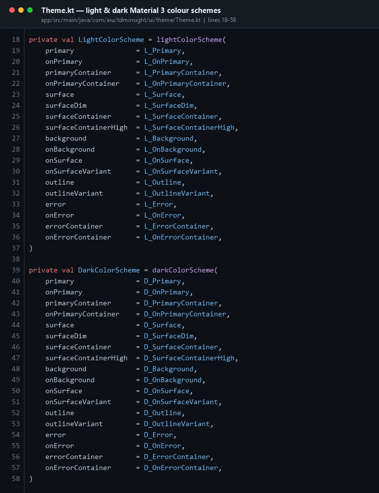

Two complete Material 3 colour schemes — `LightColorScheme` and `DarkColorScheme` —
built from named constants in `Color.kt`.

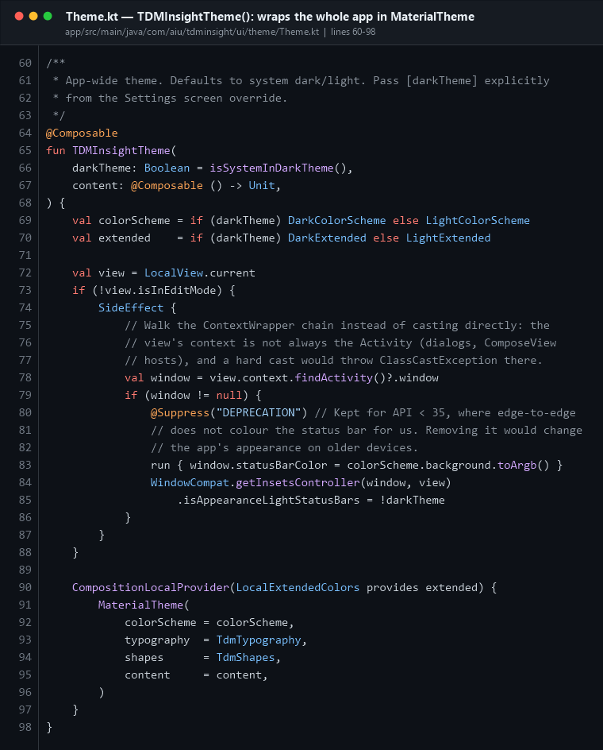

`TDMInsightTheme` picks the scheme, applies it along with `TdmTypography` and
`TdmShapes`, and uses a `SideEffect` to tint the system status bar. The
`findActivity()` helper walks the `ContextWrapper` chain instead of hard-casting,
because the view's context is not always the Activity.

## 12.3 Home screen — a complete layout, read top to bottom

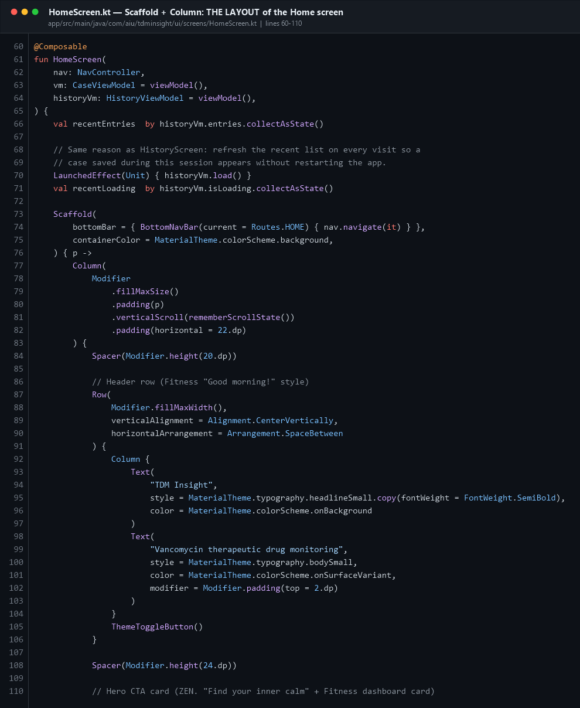

The structure:

```
Scaffold(bottomBar = { BottomNavBar(...) })
└── Column(
        .fillMaxSize()
        .padding(innerPadding)          ← keeps content clear of the nav bar
        .verticalScroll(rememberScrollState())   ← makes it scrollable
        .padding(horizontal = 22.dp)
    )
    ├── Row  ─ "TDM Insight" title  +  ThemeToggleButton
    ├── Surface ─ the big primary "Start a new calculation" card
    ├── Row  ─ two HomeShortcutTile(Modifier.weight(1f)) side by side
    ├── Row  ─ "RECENT CALCULATIONS" + "See all"
    └── when { loading → spinner; empty → RecentCasesEmpty(); else → 3 rows }
```

`LaunchedEffect(Unit) { historyVm.load() }` on line 70 re-fetches the recent list
every time the screen is entered — without it, a case saved during the session would
not appear until the app restarted.

## 12.4 Where the buttons are — the Home CTA

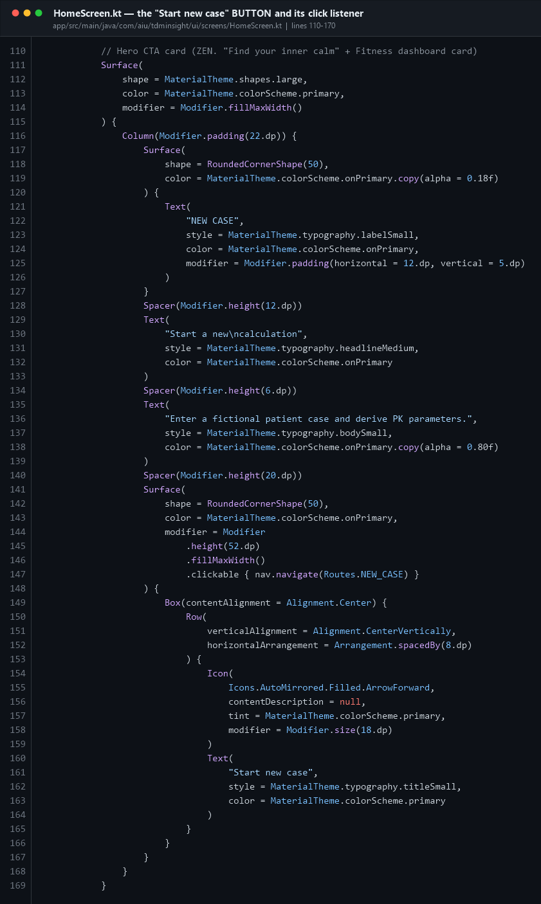

Look at lines 141–167. This is a **custom button**: a `Surface` with
`RoundedCornerShape(50)` and **`.clickable { nav.navigate(Routes.NEW_CASE) }`**.

That `clickable` lambda **is the event listener.** In Compose you do not call
`setOnClickListener` — you pass the behaviour in as a parameter, and Compose wires up
the touch handling, the ripple, and accessibility for you.

## 12.5 Conditional rendering

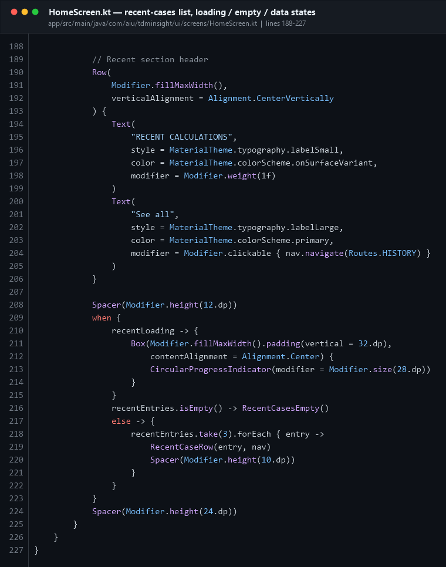

Lines 209–223 show the three-state pattern used everywhere in this app:

```kotlin
when {
    recentLoading          -> CircularProgressIndicator()
    recentEntries.isEmpty() -> RecentCasesEmpty()
    else                   -> recentEntries.take(3).forEach { RecentCaseRow(it, nav) }
}
```

Loading, empty, and data — always all three.

## 12.6 The bottom navigation bar

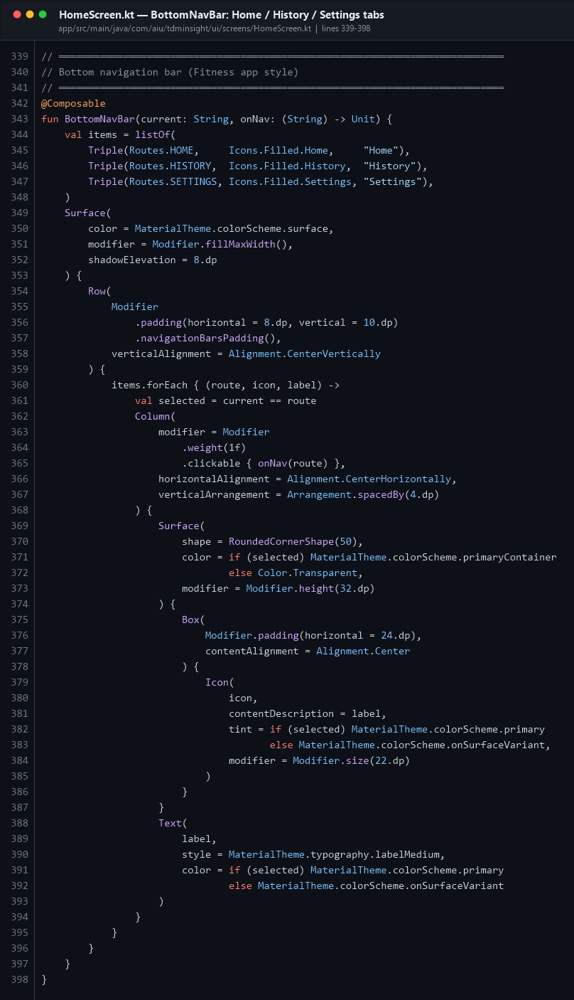

Not the Material `NavigationBar` component — a hand-built one, so the pill-shaped
selected indicator could be styled exactly as designed.

- `items` is a `listOf(Triple(route, icon, label))` — three tabs
- `items.forEach { }` builds one `Column` per tab
- `Modifier.weight(1f)` gives each tab an equal third of the width
- `.clickable { onNav(route) }` is the event listener
- `val selected = current == route` drives the highlight colour

## 12.7 The 5-step wizard — form fields and their listeners

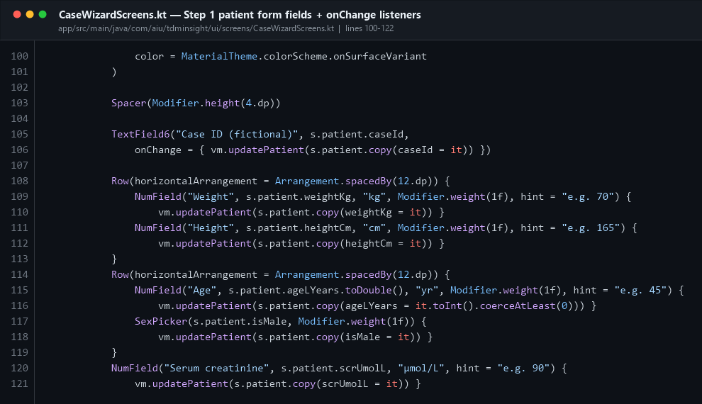

This is **Step 1 of 5**. Every field follows the same pattern:

```kotlin
NumField("Weight", s.patient.weightKg, "kg", Modifier.weight(1f), hint = "e.g. 70") {
    vm.updatePatient(s.patient.copy(weightKg = it))
}
```

Read it as: *show the current value from state; when the user types, copy the state
object with one field changed and hand it to the ViewModel.* This is **unidirectional
data flow** — the field does not own its value, the ViewModel does.

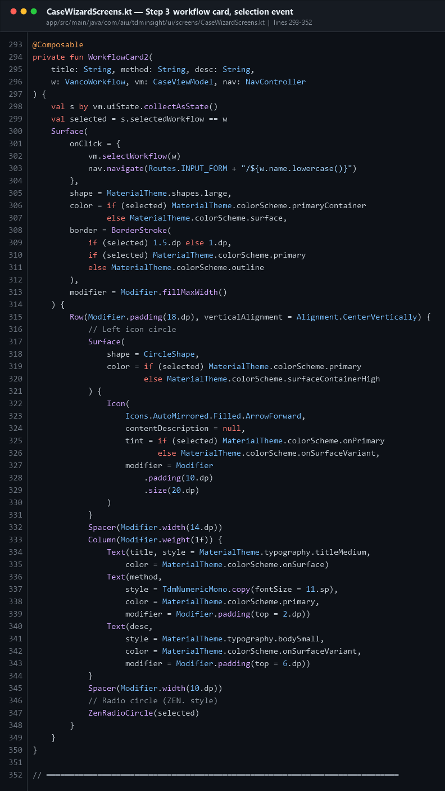

Step 3. The `WorkflowCard2` composable takes `onClick` that does **two** things:
records the choice in the ViewModel and navigates, passing the workflow name as a
route argument:

```kotlin
vm.selectWorkflow(w)
nav.navigate(Routes.INPUT_FORM + "/${w.name.lowercase()}")
```

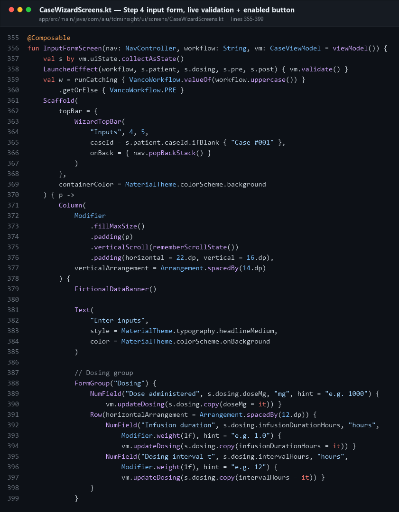

Step 4. Line 358: **`LaunchedEffect(workflow, s.patient, s.dosing, s.pre, s.post) { vm.validate() }`**
— re-validate automatically whenever any input changes. This is what makes the errors
appear live as you type.

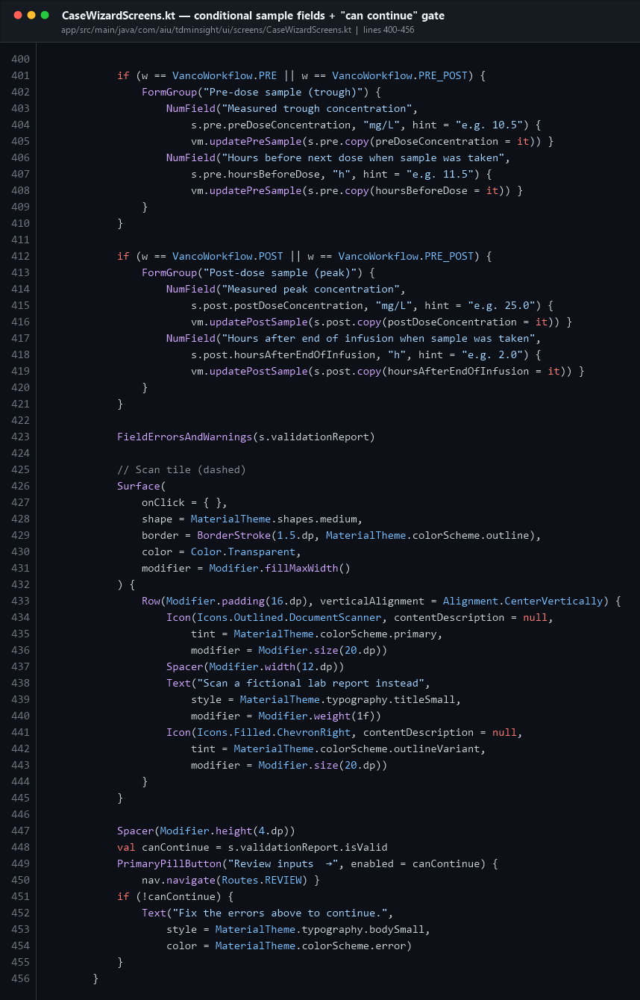

Lines 401–421 show **conditional fields**: the trough group only renders for PRE and
PRE+POST; the peak group only for POST and PRE+POST. Lines 447–455 are the gate:

```kotlin
val canContinue = s.validationReport.isValid
PrimaryPillButton("Review inputs  →", enabled = canContinue) { nav.navigate(Routes.REVIEW) }
```

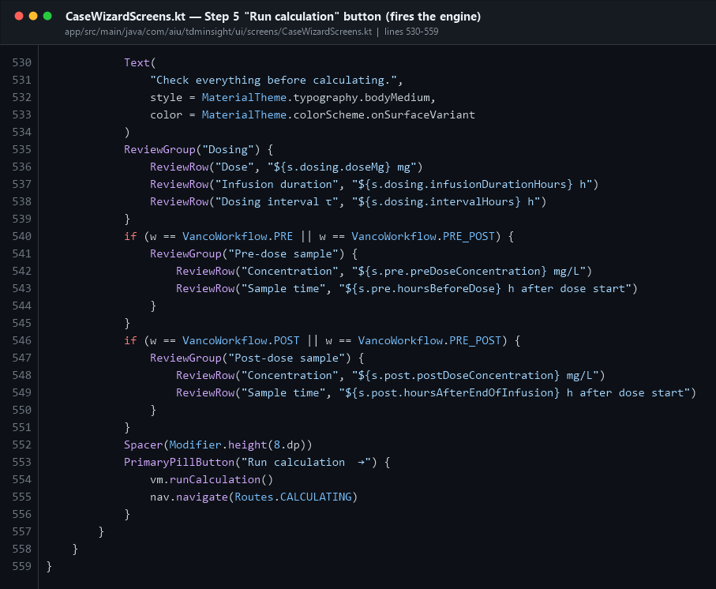

Step 5 — **the most important button in the app** (lines 553–556):

```kotlin
PrimaryPillButton("Run calculation  →") {
    vm.runCalculation()
    nav.navigate(Routes.CALCULATING)
}
```

## 12.8 The reusable components

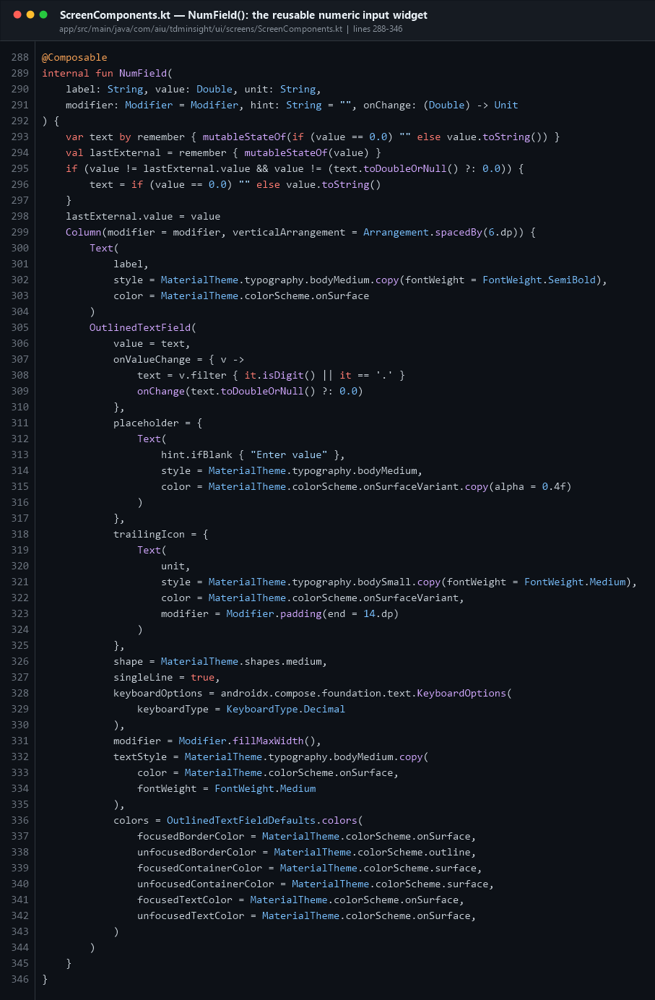

`NumField` wraps a Material 3 `OutlinedTextField`. Points worth explaining:

- `onValueChange` (line 307) is the **text-change listener**. It filters out anything
  that is not a digit or a dot, then converts to `Double` and calls back up.
- `keyboardOptions = KeyboardOptions(keyboardType = KeyboardType.Decimal)` pops the
  numeric keypad.
- `trailingIcon` renders the unit (kg, mg, h, mg/L) inside the field.
- Lines 293–298 keep the local text in sync when the ViewModel changes the value from
  outside, without fighting the user while they type.

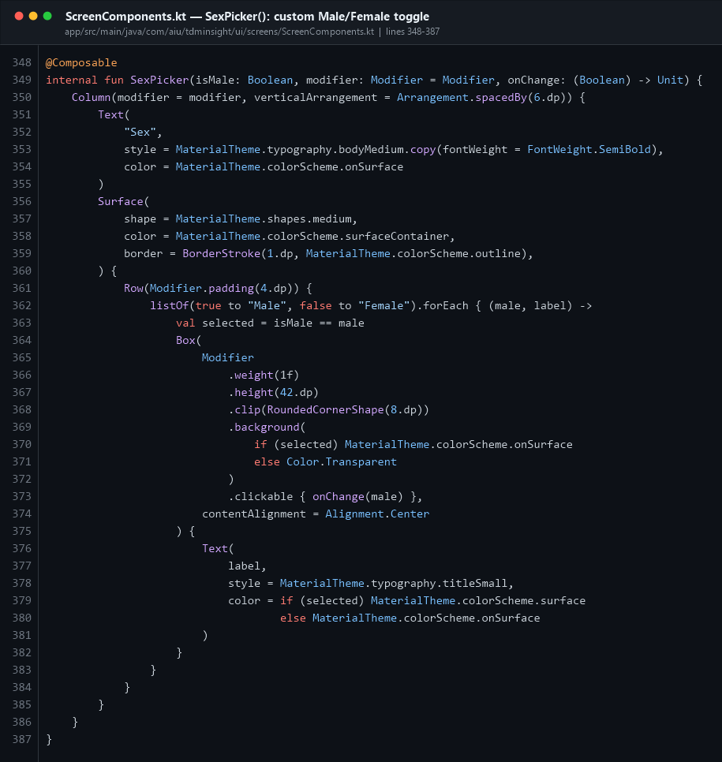

A custom segmented Male/Female control — two `Box`es with `.clickable { onChange(male) }`,
each taking `weight(1f)`, with the selected one filled.

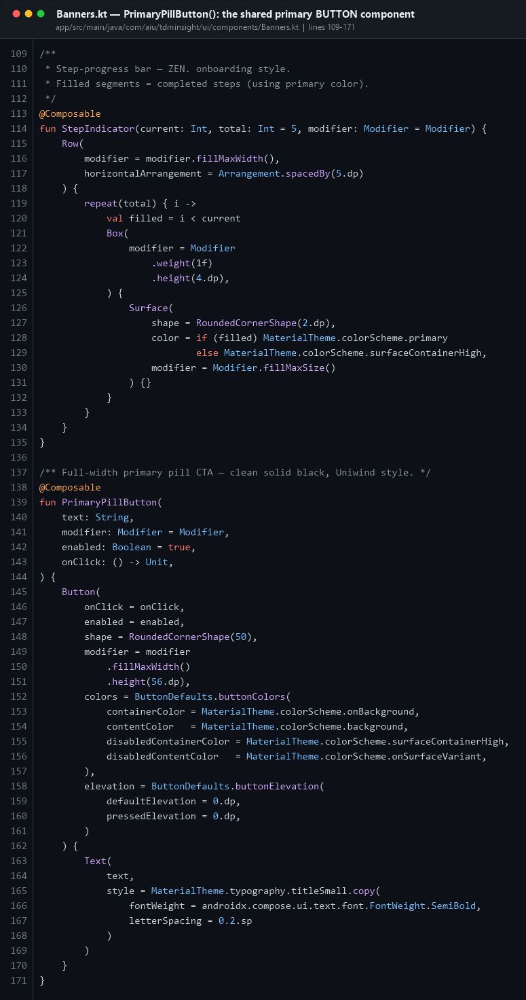

`PrimaryPillButton` is the app's standard call-to-action, used on every wizard step.
It is a Material 3 `Button` with `RoundedCornerShape(50)`, a fixed 56 dp height, and
**explicit disabled colours** so a blocked button visibly looks blocked.

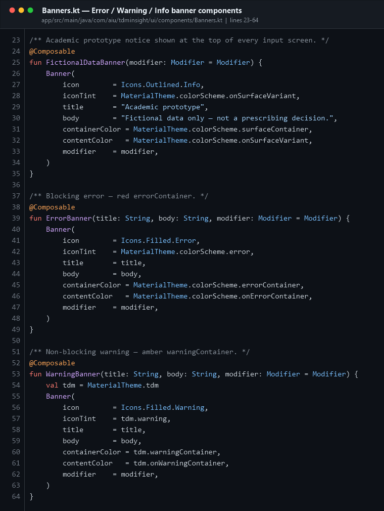

Three banner variants sharing one private `Banner` implementation:
`FictionalDataBanner` (grey, academic notice), `ErrorBanner` (red, blocking) and
`WarningBanner` (amber, advisory).

## 12.9 Calculating and Results

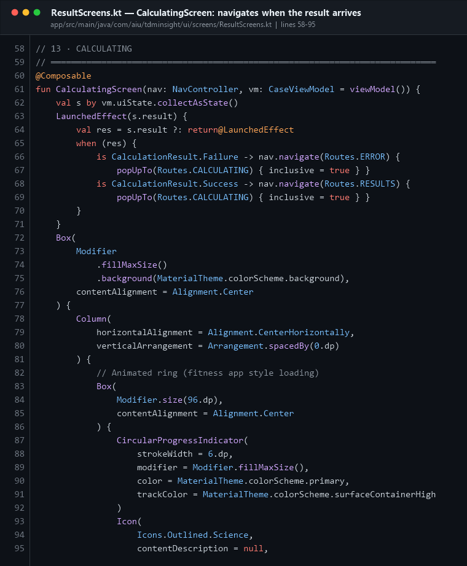

`CalculatingScreen` shows a spinner and does nothing else — except for the
`LaunchedEffect(s.result)` at line 62. When the result arrives in state, it navigates
to Results (on success) or Error (on failure), and uses
`popUpTo(CALCULATING) { inclusive = true }` so pressing Back does not return to the
loading spinner.

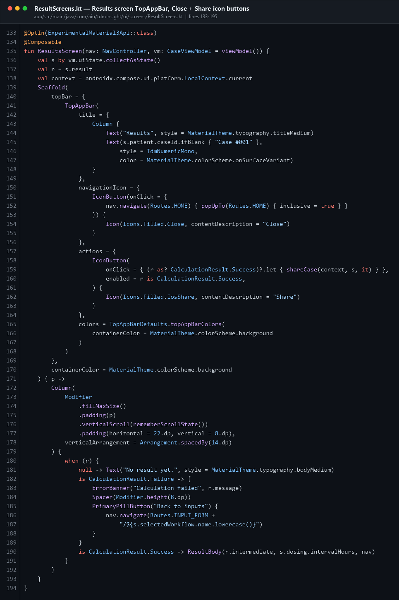

The Results screen uses a Material 3 **`TopAppBar`** with:

- `navigationIcon` — a Close `IconButton` that navigates home and clears the back stack
- `actions` — a Share `IconButton`, **`enabled = r is CalculationResult.Success`**, so
  you cannot share a failed calculation

Below it, the body renders one of three things depending on the sealed-class result:
no result / `Failure` (error banner + retry) / `Success` (`ResultBody`).

## 12.10 History and the drawn graph

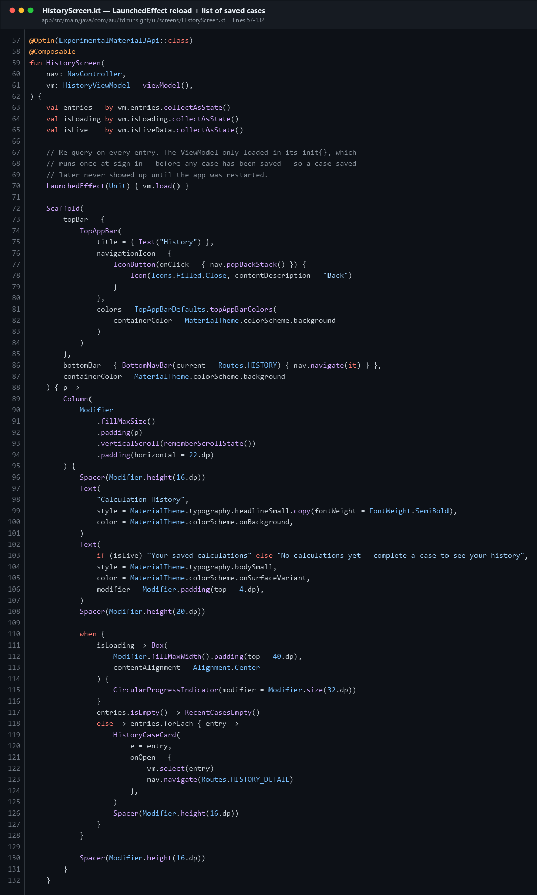

Same `LaunchedEffect(Unit) { vm.load() }` refresh pattern, the same
loading/empty/data `when`, and a `BottomNavBar`. Tapping a card calls
`vm.select(entry)` then `nav.navigate(Routes.HISTORY_DETAIL)`.

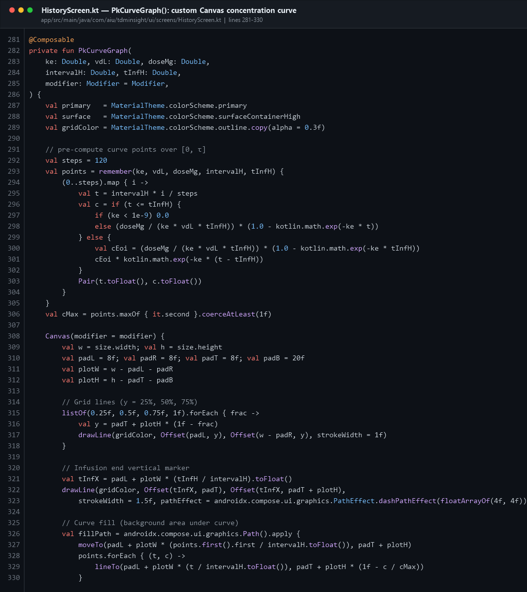

`PkCurveGraph` draws the concentration-vs-time curve **by hand** on a Compose
`Canvas`:

- 120 points are computed from the one-compartment model and cached with
  `remember(ke, vdL, doseMg, intervalH, tInfH)` so they are not recalculated on every
  frame
- during the infusion (`t ≤ T`) concentration rises; after it, it decays exponentially
- it draws grid lines, a dashed vertical marker at end-of-infusion, a translucent
  filled area, then the curve itself with `Stroke(width = 2.5f, cap = StrokeCap.Round)`

💬 **"Did you use a charting library?"**
> "No — the graph is drawn directly on a Compose `Canvas` using `drawLine` and
> `drawPath`. The curve points come from the same one-compartment model the engine
> uses, and they are cached with `remember` so they are only recomputed when the PK
> parameters change."

## 12.11 Settings

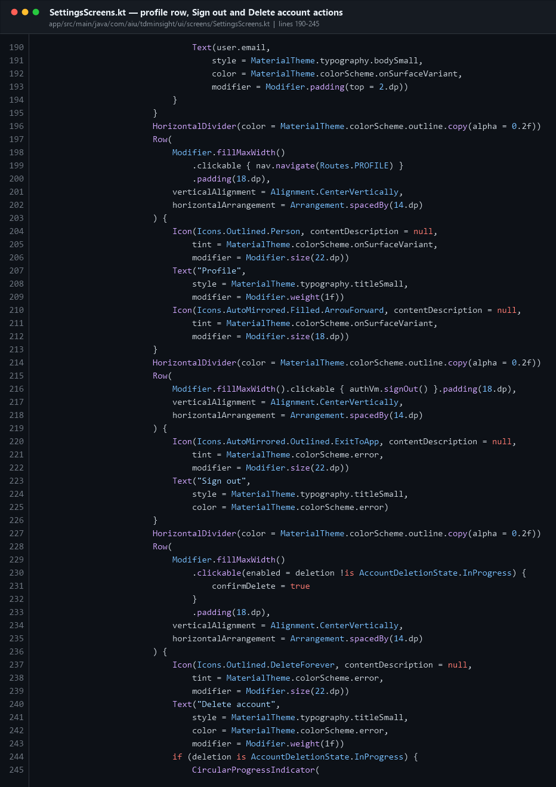

The account section: a profile row that navigates to `Routes.PROFILE`, a **Sign out**
row (`.clickable { authVm.signOut() }`), and a **Delete account** row that opens an
`AlertDialog` confirmation before calling `authVm.deleteAccount()`.

## 12.12 The splash screen

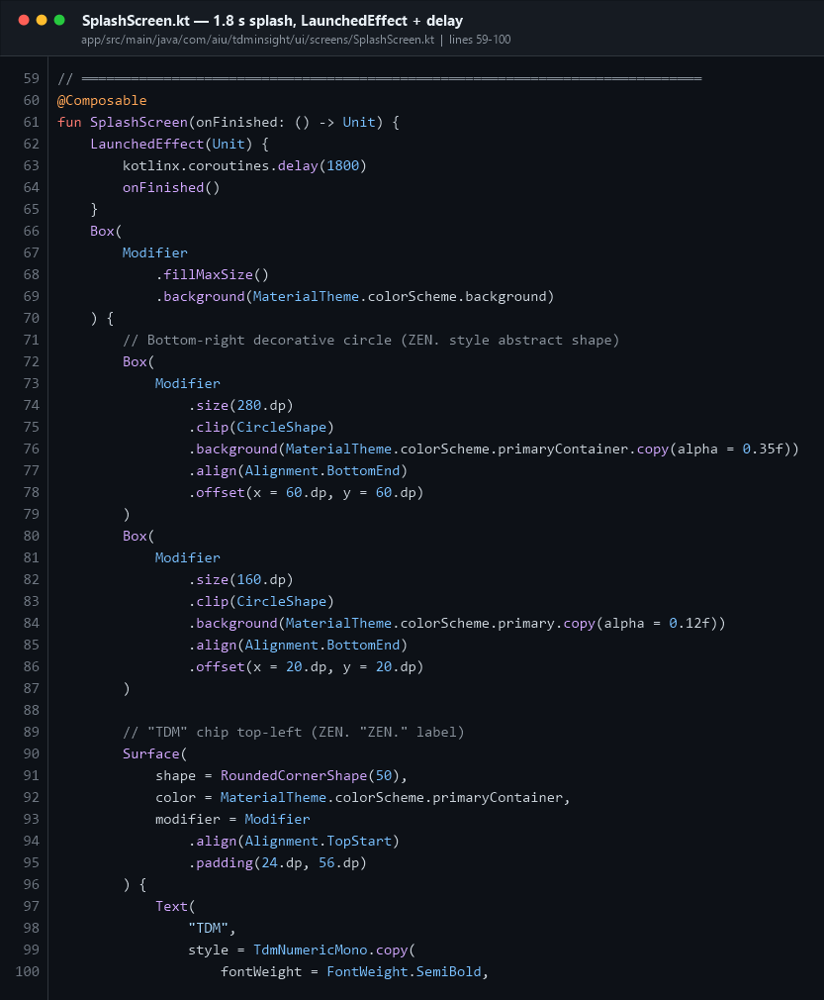

`LaunchedEffect(Unit) { delay(1800); onFinished() }` — a coroutine that waits 1.8
seconds then flips `splashDone` in `MainActivity`. The rest is decorative `Box`es and
a `LinearProgressIndicator`.

---

# PART 13 · PDF export and sharing

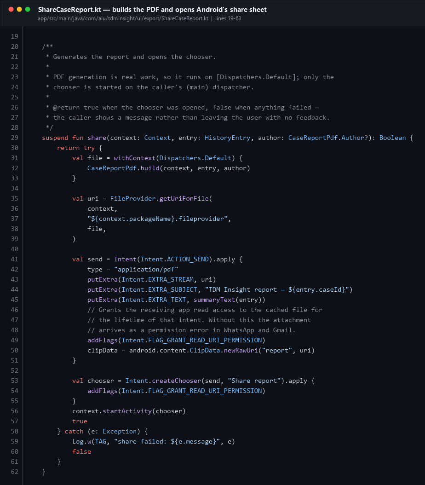

`ShareCaseReport.share()`:

1. Builds the PDF on `Dispatchers.Default` (real work — keep it off the main thread).
2. Converts the file to a `content://` URI with
   `FileProvider.getUriForFile(context, "${packageName}.fileprovider", file)`.
3. Creates an `ACTION_SEND` intent with `type = "application/pdf"`, the URI in
   `EXTRA_STREAM`, and **`FLAG_GRANT_READ_URI_PERMISSION`** — without that flag the
   attachment arrives in WhatsApp or Gmail as a permission error.
4. Wraps it in `Intent.createChooser()` and starts it.

`CaseReportPdf.kt` (657 lines) builds the document page by page using Android's
`android.graphics.pdf.PdfDocument`.

---

# PART 14 · Tests and resources

## 14.1 Unit tests

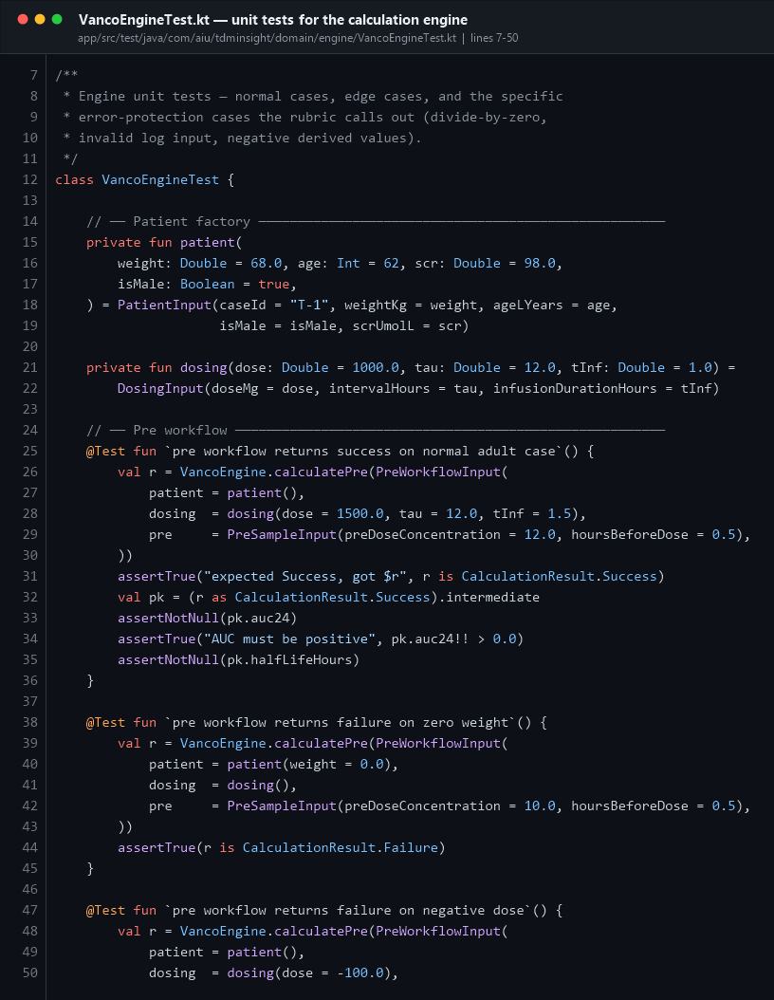

`VancoEngineTest` covers normal adult cases, the elderly/renal-impairment edge case,
and the **error-protection cases the rubric asks for**: zero weight, negative dose,
divide-by-zero, invalid logarithm input.

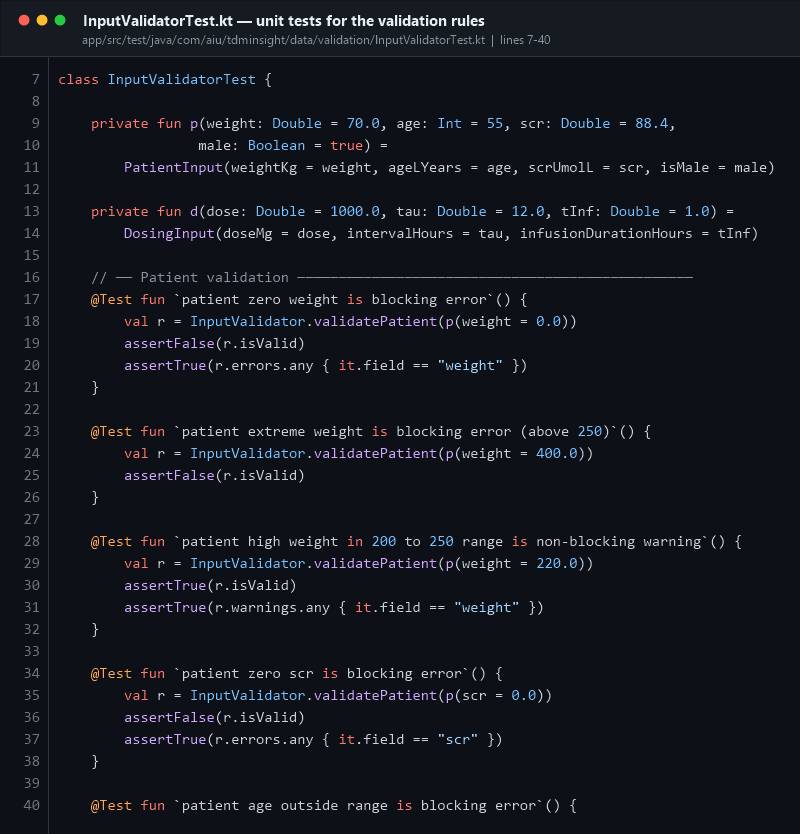

`InputValidatorTest` checks that each rule produces the right severity — a blocking
`Error` for out-of-range values and a non-blocking `Warning` for merely unusual ones.

Both test classes run on a plain JVM (no emulator) because neither `VancoEngine` nor
`InputValidator` imports anything from Android. Run them with:

```bash
gradlew test
```

## 14.2 Resources

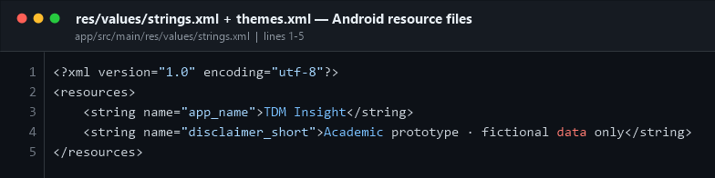

| File | Contents |
|---|---|
| `values/strings.xml` | `app_name` = "TDM Insight", plus a short disclaimer string |
| `values/themes.xml` | A **minimal** XML theme — only so the launcher and the window background are not a white flash before Compose takes over. The real theme is `ui/theme/Theme.kt`. |
| `values/colors.xml`, `values-night/colors.xml` | The window background for light and dark |
| `drawable/ic_launcher_foreground.xml`, `mipmap-anydpi-v26/` | The adaptive app icon |
| `xml/file_paths.xml` | Restricts the FileProvider to `cache/shared_reports/` only |
| **`layout/`** | **Does not exist — by design. This is a Compose app.** |

---

# PART 15 · Following one tap all the way through

This is the story to tell if the teacher asks you to "explain how your app works".

```
 1. User taps "Run calculation  →"        CaseWizardScreens.kt : 553
       ↓  the onClick lambda runs
 2. vm.runCalculation()                   CaseViewModel.kt : 101
       ↓
 3. validate()                            CaseViewModel.kt : 76
       → InputValidator.validatePatient / validateDosing / validatePreSample …
       → if any Error: return immediately, button was already disabled
       ↓
 4. _uiState.update { isCalculating = true }
       ↓  Compose sees the state change and the spinner appears
 5. nav.navigate(Routes.CALCULATING)      → CalculatingScreen
       ↓
 6. viewModelScope.launch {
        withContext(Dispatchers.Default) {     ← BACKGROUND THREAD
            VancoEngine.calculatePrePost(...)  ← domain/engine/VancoEngine.kt : 206
                ke  = ln(Cpeak / Ctrough) / Δt
                t½  = ln(2) / ke
                Vd  = D(1 − e^(−ke·T)) / (ke·T·Cpeak)
                CL  = ke × Vd
                AUC = (D/τ) × 24 / CL
                recommended dose = 500 × CL × τ / 24
        }
    }
       ↓  returns CalculationResult.Success(workflow, PkResults)
 7. _uiState.update { result = …, isCalculating = false }
       ↓
 8. CalculatingScreen's LaunchedEffect(s.result) fires
       → nav.navigate(Routes.RESULTS) with popUpTo(CALCULATING, inclusive)
       ↓
 9. ResultsScreen recomposes and draws the AUC₂₄ verdict + PK cards
       ↓  (in parallel, fire-and-forget)
10. supabaseRepository.saveCase(...)      SupabaseRepository.kt : 38
       → builds CaseDto with @SerialName column mappings
       → supabase.from("cases").insert(dto)
       → POST to PostgREST → INSERT INTO cases
       → any failure is caught and logged; the user's result is unaffected
       ↓
11. Next time History opens, loadRecentCases() does
       SELECT * FROM cases WHERE user_id = ? ORDER BY created_at DESC LIMIT 20
```

---

# PART 16 · ★ QUICK ANSWER CHEAT SHEET

Print this page. These are the exact answers to the questions you listed.

| Teacher's question | Your answer | File |
|---|---|---|
| **What is the main activity?** | `MainActivity` — the only Activity. It extends `ComponentActivity`, and `onCreate()` calls `setContent { }` which hosts the entire Compose UI. It is declared in `AndroidManifest.xml` with the MAIN/LAUNCHER intent filter. | `MainActivity.kt:51` |
| **Where is the logic written?** | `VancoEngine` — a pure-Kotlin singleton with all pharmacokinetic maths and no Android imports. The ViewModel decides *when* to call it; the engine decides *what* the answer is. | `domain/engine/VancoEngine.kt` |
| **What is the layout?** | There is no XML layout. The app uses **Jetpack Compose**: every screen is a `@Composable` function. `Column` replaces vertical `LinearLayout`, `Row` replaces horizontal, `Box` replaces `FrameLayout`, and `Modifier` replaces the XML attributes. | — |
| **Where is the layout section?** | `ui/screens/` — 10 files holding 20 screens. Shared widgets are in `ui/components/Banners.kt` and `ui/screens/ScreenComponents.kt`. Colours/typography are in `ui/theme/`. | `ui/screens/` |
| **What key components did you use?** | `Scaffold`, `TopAppBar`, `Surface`, `Column`, `Row`, `Box`, `Button`, `IconButton`, `OutlinedTextField`, `Icon`, `Text`, `CircularProgressIndicator`, `LinearProgressIndicator`, `AlertDialog`, `Canvas`, `NavHost`, `ViewModel`, `StateFlow`. | throughout |
| **Where are the buttons?** | Three kinds: (1) `PrimaryPillButton` — the shared CTA, a Material `Button`; (2) `IconButton` — back/close/share in top bars; (3) custom `Surface` + `Modifier.clickable` — the Home hero card, the bottom-nav tabs, the selection cards. | `ui/components/Banners.kt:139`, screens |
| **Where is the event listener?** | Compose has no `setOnClickListener`. The listener **is** the lambda you pass in: `Button(onClick = { … })`, `Modifier.clickable { … }`, `OutlinedTextField(onValueChange = { … })`. They all call a ViewModel function. | e.g. `CaseWizardScreens.kt:553` |
| **Which section is the database?** | Two halves: the **SQL** in `Kotlin_app/supabase/*.sql` defines the `cases` and `user_profiles` tables; the **Kotlin** in `data/supabase/` (client, DTOs, repository) reads and writes them. | `supabase/`, `data/supabase/` |
| **How does the API work?** | Two APIs. **Supabase/PostgREST** via the Supabase Kotlin SDK over Ktor+OkHttp for the database. **Clerk Frontend API** called directly with Ktor for sign-in, sign-up, email verification and Google OAuth. Both authenticate with keys injected through `BuildConfig`. | `data/supabase/`, `auth/ClerkAuthManager.kt` |
| **Where do you handle errors?** | Four levels: `InputValidator` blocks bad input; `guardPositive`/`guardLogSafety` protect the maths; the engine returns `CalculationResult.Failure` instead of throwing; every network call is wrapped in `try/catch` and returns a safe default. | everywhere |
| **How is state managed?** | Each ViewModel owns a private `MutableStateFlow` and exposes a read-only `StateFlow`. Screens call `.collectAsState()`. Updates use `copy()` on an immutable data class, so Compose can diff old vs new. | `viewmodel/` |

---

# PART 17 · 20 EXAM QUESTIONS WITH MODEL ANSWERS

### Q1. What is the entry point of your application, and what runs first?
**A.** `AndroidManifest.xml` declares `MainActivity` with an intent filter containing
`android.intent.action.MAIN` and `android.intent.category.LAUNCHER`, which is what puts
the icon in the launcher. But `TdmApplication` runs *first* — it is registered as
`android:name=".TdmApplication"` on the `<application>` tag, and Android creates it
before any Activity. It sets up the shared Supabase client and Clerk auth manager as
lazy singletons. Then `MainActivity.onCreate()` runs and calls `setContent { }`.

### Q2. Why is there only one Activity? Where are the other screens?
**A.** This is a single-Activity architecture, which is Google's current recommendation
for Compose apps. All 21 screens are `@Composable` functions, not Activities or
Fragments. Fifteen of them are registered as routes in `NavGraph.kt` and swapped by the
`NavHost`; the six pre-login screens (splash, disclaimer, login, sign-up, verify,
welcome) are selected by a `when` block in `MainActivity`. One Activity means no
Intent plumbing between screens and much faster transitions.

### Q3. Where is the layout defined? Why is there no `res/layout` folder?
**A.** Because this is a Jetpack Compose app. In Compose the UI is described in Kotlin
functions annotated `@Composable`, not in XML. My layout code lives in
`ui/screens/` (10 files, 20 screens) — for example `HomeScreen.kt` defines a `Scaffold` with a bottom bar,
containing a scrollable `Column` of `Surface` cards. `Column` replaces a vertical
`LinearLayout`, `Row` replaces a horizontal one, `Box` replaces `FrameLayout`, and
`Modifier.fillMaxWidth()`, `.padding()`, `.weight()` replace the XML layout attributes.
The `res` folder still exists for strings, colours, the app icon and the FileProvider
config — just not for layouts.

### Q4. Where is your business logic, and why is it separated from the UI?
**A.** In `domain/engine/VancoEngine.kt`. It is a Kotlin `object` containing the three
workflow functions and all the pharmacokinetic formulas. It imports only `kotlin.math`
and my own data models — **no Android imports at all**. That separation means (1) I can
unit-test the maths on a plain JVM with no emulator, which `VancoEngineTest.kt` does,
(2) the logic cannot break because of a UI change, and (3) the same engine could be
reused in a different app or on the desktop.

### Q5. Explain the MVVM pattern as you implemented it.
**A.** The **View** is the Compose screens — they only draw and forward events.
The **ViewModel** (`CaseViewModel`, `AuthViewModel`, `HistoryViewModel`) holds the
state in a `MutableStateFlow` and exposes it read-only as a `StateFlow`. The
**Model** is the data layer: the data classes, `InputValidator`, `VancoEngine` and
`SupabaseRepository`. Data flows **down** (ViewModel → state → UI), events flow **up**
(UI → `vm.updatePatient(...)` → new state). The View never touches the database.

### Q6. Where are your buttons and where are the event listeners?
**A.** There are three kinds of button. The shared call-to-action is
`PrimaryPillButton` in `ui/components/Banners.kt` — a Material 3 `Button` with a pill
shape. Top bars use `IconButton` for back, close and share. Cards like the Home hero
CTA and the bottom-nav tabs are a `Surface` with `Modifier.clickable { }`.
There is no `setOnClickListener` anywhere, because Compose has no such method: the
listener **is** the lambda you pass in. For example
`PrimaryPillButton("Run calculation →") { vm.runCalculation(); nav.navigate(Routes.CALCULATING) }`
in `CaseWizardScreens.kt` line 553 — that trailing lambda is the click handler.

### Q7. What happens, step by step, when the user taps "Run calculation"?
**A.** The lambda calls `vm.runCalculation()`. That validates the inputs, returns early
if anything is invalid, sets `isCalculating = true`, then launches a coroutine in
`viewModelScope`. Inside, `withContext(Dispatchers.Default)` moves the maths to a
background thread and calls the matching `VancoEngine` function. The result is written
back into the `StateFlow`. Meanwhile the UI navigated to `CalculatingScreen`, whose
`LaunchedEffect(s.result)` notices the result arriving and navigates to Results or
Error. Separately, a nested `launch` saves the case to Supabase in a `try/catch`, so a
network failure never affects what the user sees.

### Q8. How do you keep the UI responsive during the calculation?
**A.** `viewModelScope.launch { withContext(Dispatchers.Default) { … } }`.
`Dispatchers.Default` is the CPU-work thread pool, so the main thread stays free to
draw. `viewModelScope` ties the coroutine to the ViewModel's lifetime, so if the user
leaves the screen the work is cancelled automatically and there is no memory leak.

### Q9. Describe your database schema.
**A.** Two PostgreSQL tables in Supabase, defined in `supabase/schema.sql`.
**`cases`** holds one row per completed calculation: a `uuid` primary key generated by
`gen_random_uuid()`, the Clerk `user_id`, `created_at`, the case label and workflow,
the patient demographics, the dosing regimen, the measured samples (nullable, because
not every workflow uses both), and all the derived PK results including `auc24` and
`recommended_dose_mg`. There is a `check` constraint restricting `workflow` to
`'PRE'`, `'POST'` or `'PRE_POST'`, and a composite index on `(user_id, created_at desc)`
for fast history queries. **`user_profiles`** holds the Clerk identity plus
app-owned fields — institution, department and role — with the Clerk `user_id` as the
primary key.

### Q10. How do you prevent duplicate user rows when someone logs in repeatedly?
**A.** `user_id` is the **primary key** of `user_profiles`, and
`SupabaseRepository.syncUserProfile()` uses a single
`upsert(listOf(dto), onConflict = "user_id", defaultToNull = false)`. Because it is one
atomic SQL statement, the first login inserts and every login afterwards updates the
same row — there is no read-then-write window where two rapid logins could race into
two rows. `defaultToNull = false` also means columns not in the payload
(institution, department, role) are left untouched, so a login never wipes data an
administrator set.

### Q11. How does the app talk to the database? Is it raw SQL?
**A.** No raw SQL from the app. It uses the Supabase Kotlin SDK's **Postgrest** plugin,
which is a typed wrapper over Supabase's PostgREST HTTP API, running on Ktor with the
OkHttp engine. For example, `loadRecentCases()` writes
`from("cases").select { filter { eq("user_id", userId) }; order("created_at", DESCENDING); limit(20) }`,
which PostgREST turns into
`SELECT * FROM cases WHERE user_id = ? ORDER BY created_at DESC LIMIT 20`. The rows come
back as JSON and `decodeList<CaseDto>()` deserialises them with kotlinx-serialization.

### Q12. What is a DTO and why did you need `@SerialName`?
**A.** A DTO — Data Transfer Object — is the wire format: a class whose shape matches
the database table, not the app's domain model. `CaseDto` is mine. I need
`@SerialName("weight_kg")` on each field because Kotlin convention is camelCase
(`weightKg`) but PostgreSQL convention is snake_case (`weight_kg`); the annotation maps
between them. The function `toHistoryEntry()` then converts the DTO into the domain
model `HistoryEntry`, which keeps the UI independent of the database schema — if a
column were renamed, only the DTO and the mapper would change.

### Q13. How is authentication implemented?
**A.** With **Clerk**, called through its Frontend API directly over Ktor rather than
the Android SDK. `ClerkAuthManager` handles email+password sign-in and sign-up, the
6-digit email verification code, and Google OAuth. `AuthRepository` persists the
session in private SharedPreferences so the user stays logged in across restarts, and
`AuthViewModel` exposes it as an `AuthState` sealed class that `MainActivity` observes.
On success the Clerk identity is upserted into the Supabase `user_profiles` table.

### Q14. Explain the Google sign-in flow and the deep link.
**A.** Six steps. (1) `AuthViewModel.startGoogleSignIn()` asks Clerk for a Google
consent URL. (2) `MainActivity` opens it with `Intent(ACTION_VIEW, url)` in the system
browser. (3) The user approves. (4) Clerk redirects to `tdminsight://oauth-callback`.
(5) The second `<intent-filter>` in `AndroidManifest.xml` — scheme `tdminsight`, host
`oauth-callback` — routes that URL back into `MainActivity.onNewIntent()`, and because
`launchMode="singleTask"` it goes to the *same* instance rather than a new one.
(6) `completeGoogleSignIn(url)` hands the whole URL to Clerk, because its query string
carries the rotated device token for the session.

### Q15. What is a `sealed class` and where did you use one?
**A.** A sealed class defines a **closed set** of subtypes — the compiler knows every
one of them, so a `when` over it is exhaustive and you cannot forget a case. I used
three: `CalculationResult` (`Success` | `Failure`), `AuthState` (`Loading`,
`Unauthenticated`, `Authenticated`, `AwaitingEmailCode`, `Error`) and `FieldResult`
(`Valid`, `Error`, `Warning`). It is how the app models "this operation either worked
or gave a reason why not" without throwing exceptions across layers.

### Q16. How do you validate input, and what is the difference between an error and a warning?
**A.** `InputValidator` — a pure-Kotlin object — checks each field against a
physiological range and returns a `ValidationReport` containing a list of
`FieldResult.Error` and a list of `FieldResult.Warning`. An **Error** is blocking: it
shows a red banner and the Continue button stays disabled, because
`canContinue = report.isValid`. A **Warning** is advisory: an amber banner, but the
user can proceed — for example a weight above 200 kg or a trough above 25 mg/L is
unusual but not impossible. Validation runs on every keystroke via
`LaunchedEffect(workflow, patient, dosing, pre, post) { vm.validate() }`.

### Q17. How do you protect against divide-by-zero and invalid logarithms?
**A.** Three layers. First `InputValidator` rejects zero or negative weights,
concentrations and intervals before anything else runs. Second `guardLogSafety(pre, post)`
checks both concentrations are positive before the Sawchuk–Zaske `ln(Cpeak/Ctrough)`.
Third, inside the engine, every derived quantity — Δt, ke, Vd, CL — passes through
`guardPositive()`, which throws an `ArithmeticException` if the value is non-finite or
≤ 0. The surrounding `try/catch` converts that into a `CalculationResult.Failure` with
a readable message, and the app shows the Error screen. It never crashes. The POST
workflow adds a fourth: if Newton–Raphson does not converge in 50 iterations, it
returns a Failure explaining that the sample time or concentration is implausible.

### Q18. Which Jetpack Compose components did you use, and what does `Modifier` do?
**A.** Layout: `Scaffold`, `Column`, `Row`, `Box`, `Spacer`, `Surface`.
Content: `Text`, `Icon`, `Image`.
Input: `OutlinedTextField`, `Button`, `IconButton`, `TextButton`.
Feedback: `CircularProgressIndicator`, `LinearProgressIndicator`, `AlertDialog`.
Structure: `TopAppBar`, `NavHost`. Custom drawing: `Canvas`.
`Modifier` is a chainable decorator that replaces XML layout attributes — it sets size
(`fillMaxWidth`, `size`, `weight`), spacing (`padding`), appearance (`background`,
`clip`, `border`) and behaviour (`clickable`, `verticalScroll`). **Order matters**:
`.padding().background()` paints the background inside the padding, while
`.background().padding()` paints it outside.

### Q19. How does state work in Compose, and what are `remember`, `LaunchedEffect` and `collectAsState`?
**A.** Compose is declarative: when state changes, the affected functions re-run —
that is **recomposition**. `remember { mutableStateOf(...) }` keeps a value across
recompositions (I use it for local UI state like `showSignUp` or a text field's raw
string). `collectAsState()` subscribes a Composable to a `StateFlow` from a ViewModel
and turns each emission into a recomposition. `LaunchedEffect(key)` runs a coroutine
as a **side effect**, restarting only when the key changes — I use it to refresh
history on screen entry (`LaunchedEffect(Unit)`), to re-validate when inputs change,
and in `CalculatingScreen` to navigate once the result appears.

### Q20. What would you improve if you continued this project?
**A.** Five things, in priority order.
(1) **Security:** finish the Clerk→Supabase JWT template so the strict per-user RLS
policies in `update_v4.sql` can be enabled, making row filtering server-enforced rather
than client-side, and remove the hard-coded key fallbacks from `build.gradle.kts`.
(2) **Offline support:** add a Room database so cases save locally and sync later,
instead of being lost when the network is down.
(3) **Features already stubbed in the UI:** the "Scan lab report" tile and the
Gentamicin/Amikacin workflows are placeholders.
(4) **Testing:** add Compose UI tests with `createComposeRule` — the dependency is
already declared — and test the repository with a fake Supabase client.
(5) **Dependency injection:** replace the manual singletons in `TdmApplication` with
Hilt, which would make the ViewModels properly testable.

---

## Appendix · Numbers you should be able to quote

| Fact | Value |
|---|---|
| Kotlin source files | 39 (37 main + 2 test) |
| Total Kotlin lines in `app/src/main` | ~9,050 |
| SQL lines across the 4 migration files | ~665 |
| Activities | 1 (`MainActivity`) |
| Composable screens | 21 (20 in `ui/screens/` + `FirstLaunchDisclaimer` in `MainActivity.kt`) |
| Navigation routes | 15 |
| ViewModels | 3 |
| Database tables | 2 (`cases`, `user_profiles`) |
| SQL migration files | 4 |
| Calculation workflows | 3 (PRE, POST, PRE+POST) |
| Unit test classes | 2 |
| Android permissions requested | 1 (`INTERNET`) |
| minSdk / targetSdk | 26 / 35 |
| AUC₂₄ therapeutic target | 400–600 mg·h/L (centre 500) |

---

*Generated for CDE2313 · TDM Insight · Albukhary International University.*
*Every screenshot in this document is taken from the actual source files in
`Kotlin_app/`, with the real file path and line numbers shown in each image header.*
